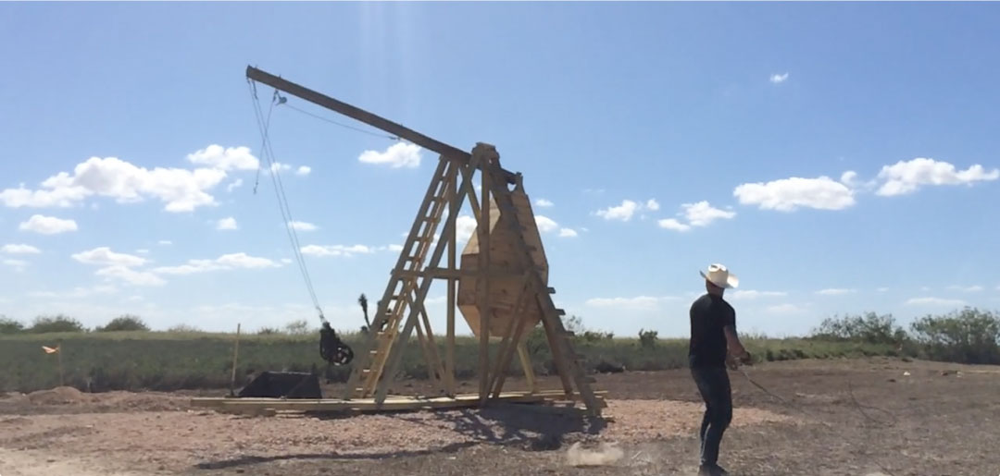
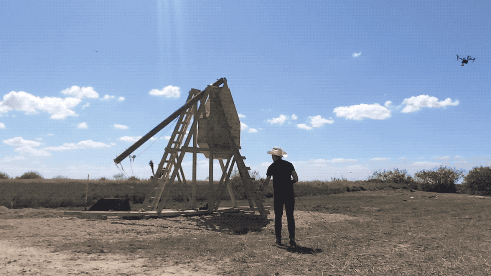

No matter where you stand on political issues, I think that we can all agree that we are living in strange times. Back in October of 2017, I was contacted by my good friend Roman Titus with an offer to help him build a 30-foot trebuchet on the Mexican border to support the <a href="https://www.cardsagainsthumanitysavesamerica.com/" target="_new">Cards Against Humanity Saves America</a> Campaign. When a friend calls you with that pitch, how in the world do you turn them down?

CAH's thinking for this project was absolutely brilliant. The master plan involved buying vacant land on the Texas side of the southern border, distributing that land to thousands of owners, and then retaining a leading eminent domain law firm to argue on behalf of the landowners. If the Trump administration wished to use eminent domain to procure this vital tract of land, they would need to go through a massive legal headache to do so. Would it stop them? Probably not. Would it slow the process and draw a lot of attention? Definitely.

  
  <a class="image-caption">The trebuchet</a>

In that vein of drawing a lot of attention, purchasing a tract of land outside of Brownsville, Texas is not the way to do it. The acreage that they bought was well outside of city limits, and was only frequented by border patrol and the few folks who had staked their claim out in the boonies. You know what does get attention? A 30-foot trebuchet.

  
According to CAH, "Since the Trump administration is committed to using 12th-century military technology to protect our country from Mexican invaders, we have responded in kind by building a 30-foot trebuchet, a medieval catapult designed to destroy walls."

  

    
    <a class="image-caption">Launching the trebuchet</a>
  

Roman built the entire trebuchet back at his farm in Ohio, but getting it down to the border was an ordeal in itself. The rig has to be completely disassembled at the farm and then reassembled at the border - that was where I came in. I flew to Brownsville to meet Roman and the trucker he hired to get the project down there. We were able to reassemble the trebuchet in around a day, and then spent the next two days launching all sorts of projectiles and filming with the CAH crew.

This has been one of the most rewarding projects I've worked on, and I'm so glad that it was done in support of making a strong political statement. Sweating like crazy and working like a dog in Southern Texas is totally worth it when you get to help build something like this. Check out the full process video below.

<iframe src="https://player.vimeo.com/video/242332236" style="position:absolute;top:0;left:0;width:100%;height:100%;" frameborder="0" webkitallowfullscreen mozallowfullscreen allowfullscreen></iframe>
 
