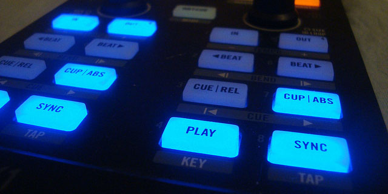
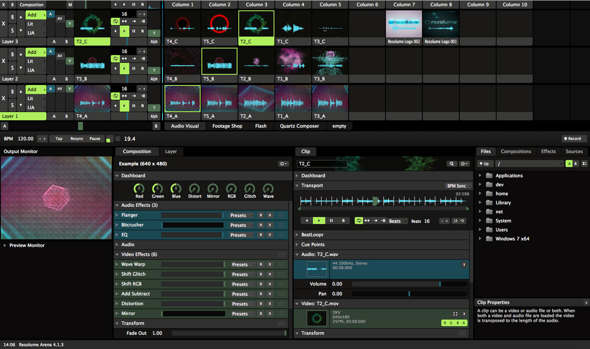
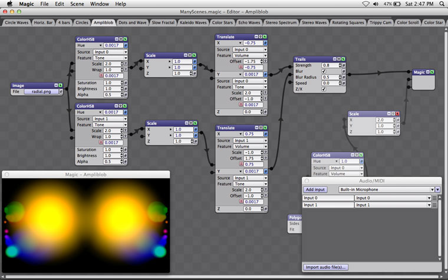
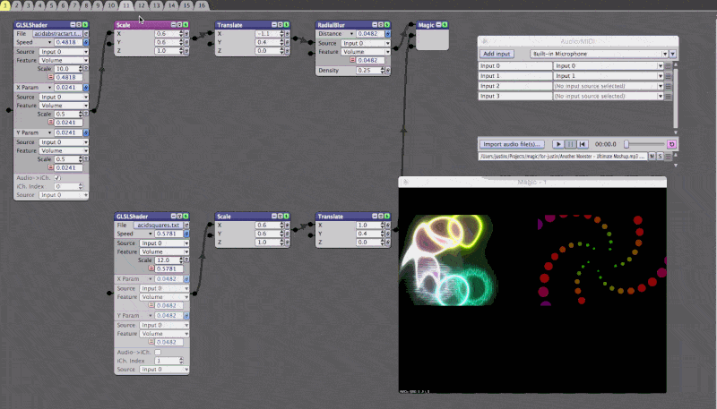
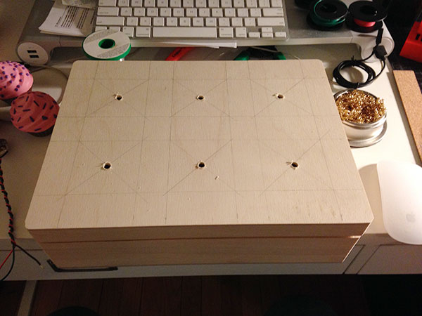
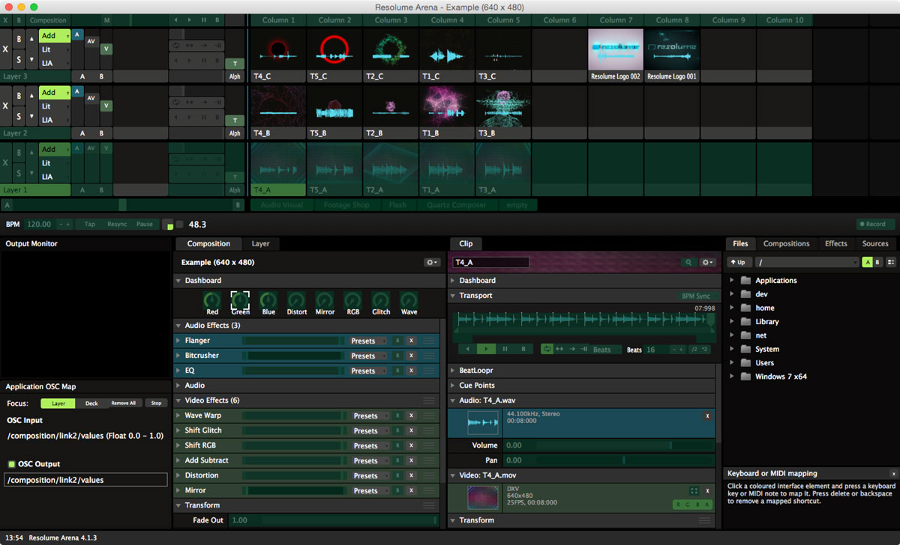

I've been interested in projection mapping ever since I saw what <a href="http://www.lvthn.com/work/wooden-toy/" target="_blank">Leviathan</a> and <a href="http://vsquaredlabs.com/project/amon-tobin/">V Squared Labs</a> came up with for <a href="https://www.youtube.com/watch?v=0zMI-qbmIPk" target="_blank">Amon Tobin's ISAM tour</a>. I wasn't able to attend the concert in person, but even just watching the footage inspired a sense of awe in me. The whole project seemed like it was a <a href="http://en.wikipedia.org/wiki/Clarke%27s_three_laws" target="_blank">combination of magic and technology</a>, and I knew that I had to work with it.

My interest stayed dormant for a few years until I recieved a Tweet out of the blue asking if I wanted to collaborate to make something "collossal." How do you say no to that?

<div class="paragraph-with-picture">
	<p>The message came from an artist named <a href="http://georgeberlin.com/" target="_blank">George Berlin</a>. George's background is in illustration, but he's also well-versed in animation and projection mapping. He explained to me that he was wrestling with how to control his projects with objects in the real world. The software that he uses to control the projections can be mapped to a MIDI controller, but interacting with a controller takes a lot of magic out of the visualization.</p>

  <div class="image-container small-image">
    
    <a href="https://www.flickr.com/photos/sebilden/13107904853/in/photolist-kYirrx-cMizwA-4ZHL9q-4YDdRY-4ZBGTD-4YDdRj-4YDdSA-7FWaZK-75TB6u-bHqmAZ-buvCk3-buvmKW-buvFcw-bHqcrV-buvuNu-9UCdcZ-etdr3o-4YDdT9-ghNPB-bzyEVx-4ZFXvv-7ig5hv-7ig5bt-7ijYAm-7ig5av-7ijYHd-7ijYHW-7GaRos-8w4FKU-6n1VSX-nPrtTp-o6Q8a1-nPraJj-nPrCqJ-o6Cxhc-nPrgfQ-nPrcjJ-o6PSwJ-nPsbgB-6n5Mb1-c8JyEY-75WLAN-cWDnzf-7uxE2f-fYE3S-oYk5pr-oFQYy2-2zXBBD-dWsJyU-fYDZy" target="_new" class="image-caption">Traktor X1 by sebilden</a>
  </div>

</div>

We agreed to get in touch if we bumped into an interesting project that seemed like it would be a good fit, and after a few misses due to scheduling conflicts we got the perfect opportunity. I was contacted by an old friend, <a href="http://andreagonzalez.info" target="_blank">Andrea Gonazalez</a>, who was looking for a piece for a fundraiser. Andrea is an excellent artist who went to <a href="http://www.saic.edu/index.html" target="_blank">SAIC</a> with me - she recently decided to leave the design industry to pursue her passion for French pastries. The fundraiser was an event for the <a href="http://frenchpastryschool.com" target="_blank">French Pastry School</a> called "<a href="http://www.fortheloveofchocolatefoundation.org/" target="_blank">For the Love of Chocolate</a>." The theme for the event was the '60s, and she needed a projection to transform a room into a psychedelic landscape. The room that we were in came complete with a sitar band called <a href="http://www.thegitacult.com/" target="_blank">"The Gita Cult,"</a> and a seemingly endless supply of delicious treats. This seemed like a great opportunity for a collaborative project with the ever-funky George, so we started brainstorming.

### Enough about the backstory.<br/>Here's how we made it.

Like I mentioned earlier, George has the projection mapping thing down pat, so we just needed to learn how to get an Arduino to talk to our mapping software. The first step on my side of the project was getting familar with the software.

#### Resolume
We used a program called <a href="http://resolume.com/" target="_blank">Resolume</a> to handle the projection mapping and Arduino-controlled effects. Resolume is a pretty amazing piece of software - even just playing around with the examples is impressive.

<div class="image-container large-image">
  
  <a class="image-caption">A screenshot of the Resolume Dashboard</a>
</div>

As you can see in the image above, the Resolume dashboard can be a little overwhleming at first. The general idea is that you work in compositions that group clips together for a certain arrangement. Clips are housed in the upper right quarter of the dashboard, and are queued to start playing on the first beat of the music. There are some clips that have audio baked into the file - the visuals of these files react to tempo changes from the attached audio. You set the tempo for a composition the same way that you set it for DJing&ndash;by clicking a tap button along with the count of the music.

Resolume can also add a layer of visual effects to each clip, or to the entire compostion. The effects interface is what we were interested in using it for. The visualizations that we were generating wouldn't actually be generated in Resolume - we just needed an additional layer of control and the mapping. But before we get to mapping, let's talk about how we generated the visuals to map.

#### Magic Music Visuals
<div class="paragraph-with-picture">
	<p>George was the brains behind the visuals for this project, but I still wanted to learn how he was generating them to get a better understanding of the piece end-to-end. He introduced me to a program called <a href="http://magicmusicvisuals.com/" target="_blank">Magic Music Visuals</a>. For those of you familiar with <a href="https://cycling74.com/products/max/" target="_blank">Max/MSP</a>, Magic Music Visuals (henceforth to be referred to as "MMV") is extremely similar. You interact with a set of modules by patching them together in series to create a visual circuit.</p>

  <div class="image-container small-image">
    
    <a href="http://magicmusicvisuals.com/screenshots" target="_new" class="image-caption">A screenshot of Magic Music Visuals</a>
  </div>

</div>

George has tons of these patches that he uses in his projects. To facilitate the use of the different visuals throughout the evening, we included everything in a playlist to feed the display.

<div class="image-container large-image">
  
  <a class="image-caption">Adding patches to the playlist in MMV</a>
</div>

In addition to creating some trippy visuals with George's graphic assets, MMV also handled the sound-reactive bits for us. Modules in the patch are routed through a sound-reactive module before hitting the endpoint - that module responds to a specific frequency range from a mic input, or to the overall volume. Once it sees a spike in whatever you're listening to, you can tell it what it should do to your visuals.

You'll notice that all of the visuals in MMV for our projects have two screens on them. This will be made more clear once we get to the mapping portion, but the short answer is that this was a technique that was employed to get more video with less firepower.

All of these visuals are really cool in MMV, but the software can't handle projection mapping on its own. In order to get the visuals over to Resolume, we used a program called Syphon.

#### Syphon / Spout
I completed my part of this project on a Mac, and George worked on a PC. When we installed the project, we ended running both OS's again. The only piece of the project that was different between the two computers was the utility to pass the video from MMV to Resolume. On Mac, we used a tool called <a href="http://syphon.v002.info/" target="_blank">Syphon</a>, and on Windows we used <a href="http://spout.zeal.co/" target="_blank">Spout</a>. Both of these applications are focused on sharing video between windows, and they work with a host of visualization software.

I set this up on my Mac, so I'll only be able to explain the Mac workflow in detail. The good news is that it looks like Spout is extremely well documented, so you should be able to figure that out on your own.

I downloaded an additonal module to handle Syphon for MMV from the main MMV site. The module is available from the <a href="http://magicmusicvisuals.com/resources" target="_blank">Resources</a> page as a zip file that you can incorporate into your projects.

Once downloaded, any additional modules can be added to a project by going to the "Help" menu in MMV, and then "Additional Module Folders." You'll then be able to add the Syphon module as a endpoint for your patch. As we were only broadcasting one video at a time, we only needed to set up one Syphon server endpoint.

#### Resolume Syphon Source
Once we had MMV broadcasting to a Syphon server, the next step was to get Resolume listening to that server. Lucky for us, Resolume already had Syphon support built in seamlessly. To enable this feature, we went to the preferences menu, selected video, and then checked the box to enable Syphon input and output. Once that box was checked, we were then able to select "Syphon" from the sources menu, and drag it over to be treated as a clip.

#### Resolume Effects
Getting the visuals together and ported into Resolume was the easy part - now we had to come up with something to do with them. The original plan was to send MIDI signals from the Arduino into Resolume, and then use Resolume MIDI mapping to control the desired effects. George was able to reproduce some simple keymapping from real world objects using the <a href="http://makeymakey.com/" target="_blank">Makey Makey</a>, but what we really wanted was to be able to control the effects with a potentiometer, which is just a ten-dollar word for a slider or a volume knob. After putzing around with sending MIDI signals from the Arduino with irregular success, I decided to switch over to the <a href="http://opensoundcontrol.org/introduction-osc" target="_blank">Open Sound Control</a> (OSC) protocol. OSC ended up being a lot less complicated, and I think that it's more extensible in the long run.

#### Cupcake Time!
<div class="paragraph-with-picture">
	<p>We had it in our heads from the get-go that we wanted to incorporate cupcakes into the project somehow. A lot of George's past work uses cake as a recurring theme, so the migration over to cupcakes seemed to come pretty natural for him. I snagged six plastic cupcakes from Toys"R"Us that ended up being a perfect fit for the project.</p>

  <div class="image-container small-image">
    
    <a class="image-caption">The toy cupcakes we used from Toys'R'Us</a>
  </div>

</div>

#### Enclosure Build and Arduino Wiring

<div class="paragraph-with-picture">
  <p>I got a small wooden box from a craft store to use as a project enclosure. Once everything was measured out, I drilled a hole through the middle of the plastic cupcakes big enough to fit a potentiometer handle through, then mounted them to the box. Once I had that, I wired my potentiometers, drilled holes in the box, and then mounted them so that only the handle was sticking out the top.</p>

  <div class="image-container small-image">
    
    <a class="image-caption">Project enclosure with measurements</a>
  </div>

</div>

With all of my potentiometers ready to go, it was time to start hooking components up to the Arduino. I decided to use an Arduino Micro that that I had sitting around to free up some space inside the box - all that we needed was six analog inputs, and the Micro had more than enough juice to power the project. The potentiometers were connected to the power source and ground from the Arduino, and then each of their outputs was sent to the first six analog inputs on the micro. All we needed the Arduino to do was to read the values from the potentiometers, and then broadcast that value as a string.

#### Arduino Code
The code portion for the Arduino is extremely straightforward. The Arduino reads a few values and then sends them on through the serial port. The only gotcha is that the code needs to send everything as one string, so inside the loop we're only using `Serial.print` until the last line where we use `Serial.println` to trigger a new line.

```java
// Arduino code to read multiple potentiometers, then send
// the values through serial communication

// Define an array of our potentiometer pins
const int potentiometer_pins[] = {A0,A1,A2,A3,A4,A5};

// Open a serial connection
void setup(){
  Serial.begin(9600);
}

// Loop over the first five pins,
// read and print the value, and then print a comma.
// Then read the sixth pin and print a new line to end the string.
void loop(){
  for(int i = 0; i < 5; i++){
    Serial.print(analogRead(potentiometer_pins[i]));
    Serial.print(",");
  }
  Serial.println(analogRead(potentiometer_pins[5]));
}

```

#### Processing Code

The next part of the puzzle was how to convert that analog value coming from the Arduino to an OSC message. This was accomplished by using the OSC library in Processing. The gist of the code is that we're taking the string that the Arduino's serial communication is pumping out, splitting it into an array, getting the values from the array, and then sending them to the appropriate port.

```java

// Import the Serial, OSC, and net libraries
import processing.serial.*;
import oscP5.*;
import netP5.*;

// define your vars
float redValue = 0;
float greenValue = 0;
float blueValue = 0;
float distortValue = 0;
float rgbValue = 0;
float waveValue = 0;

// Declare Serial
Serial myPort;

// Declare OSC
OscP5 oscP5;

// Declare the NetAddress for OSC
NetAddress myRemoteLocation;

void setup() {
  // List all the available serial ports
  println(Serial.list());

  // Listen for OSC messages on port 7001
  oscP5 = new OscP5(this,7001);

  // Broadcast OSC Messages to port 7000
  myRemoteLocation = new NetAddress("localhost",7000);

  // Set the port to the correct port from your Serial list (in this case it's 5)
  myPort = new Serial(this, Serial.list()[5], 9600);

  // wait until a newline to send a Serial event
  myPort.bufferUntil('\n');
}

void draw() {
  // give us a little black window to remember that this is running
  background(#000000);
}

// Set up a void for a serial event that is triggered at a newline
void serialEvent(Serial myPort) {
  // get the message until a newline - that's now our string
  String inString = myPort.readStringUntil('\n');

  // if we've got a valid message
  if (inString != null) {
    // trim the string
    inString = trim(inString);

    // then split the values at the commas and put it into an array
    float[] effects = float(split(inString, ","));

    // if we have effects, then start sending OSC messages
    if (effects.length >= 4) {
      // get the value, then map it from the pot input (0-1023) to the value we need (0.0-1.0)
      // RED POT
      redValue = map(effects[0], 0, 1023, 0, 1);
      // print the value
      println(redValue);
      // Make a new message with the correct target
      OscMessage redMessage = new OscMessage("/composition/video/effect1/opacity/values");
      // Add the value to the message
      redMessage.add(redValue);
      // Send the message
      oscP5.send(redMessage, myRemoteLocation);

      // GREEN POT
      greenValue = map(effects[1], 0, 1023, 0, 1);
      OscMessage greenMessage = new OscMessage("/composition/video/effect2/opacity/values");
      greenMessage.add(greenValue);
      oscP5.send(greenMessage, myRemoteLocation);

      // BLUE POT
      blueValue = map(effects[2], 0, 1023, 0, 1);
      OscMessage blueMessage = new OscMessage("/composition/video/effect3/opacity/values");
      blueMessage.add(blueValue);
      oscP5.send(blueMessage, myRemoteLocation);

      // DISTORT POT
      distortValue = map(effects[3], 0, 1023, 0, 1);
      OscMessage distortMessage = new OscMessage("/composition/video/effect4/param1/values");
      distortMessage.add(distortValue);
      oscP5.send(distortMessage, myRemoteLocation);

      // RGB POT
      rgbValue = map(effects[4], 0, 1023, 0, 1);
      OscMessage rgbMessage = new OscMessage("/composition/video/effect5/opacity/values");
      rgbMessage.add(rgbValue);
      oscP5.send(rgbMessage, myRemoteLocation);

      // WAVE POT
      waveValue = map(effects[5], 0, 1023, 0, 1);
      OscMessage waveMessage = new OscMessage("/composition/video/effect6/param2/values");
      waveMessage.add(waveValue);
      oscP5.send(waveMessage, myRemoteLocation);
    }
  }
}
```

#### Back to Resolume
You may be wondering what the parts of the Processing code that set the OscMessage are doing and where we got those values from. Resolume allows you to map OSC values to any number of things inside the software. To edit this map, all you need to do is select "Mapping > Edit Application OSC Map." That should change your screen to look like the screenshot below.

<div class="image-container large-image">
  
  <a class="image-caption">Resolume ready for OSC mapping</a>
</div>

When you click on a green box that overlays something, a tile will pop up in the lower right-hand side with the title "Application OSC Map." In the screenshot, I have the green channel for the composition selected. The piece we need is the "OSC Input" string. If you look back at the Processing code now, you'll see that all we're doing is setting the new OscMessage parts to equal the correct string from OSC Input in Resolume.

There is a distinction between composition and layer as to what the effects do to your project. If you make these changes while "composition" is selected, the effects will alter then entire piece. If you make changes with just the "layer" tab selected, it only affects that one layer and leaves everything else alone. We decided to go with composition-wide effects for the project to let folks really remix how they experienced the visualization.

<div class="video-wrapper">
  <iframe width="560" height="315" src="https://www.youtube.com/embed/q9AD-J5n9wE?rel=0&amp;showinfo=0" frameborder="0" allowfullscreen></iframe>
</div>

#### Code Recap
There are a lot of moving parts with this project, so I ended up making a checklist to make sure that everything was flowing in the correct order.

1. Visuals are generated in MMV
1. MMV Visuals are sent through the MMV Syphon Component
1. Resolume listens to MMV via a Syphon clip
1. Arduino reads the value of the potentiometers and then sens a string through serial
1. Processing picks up that serial string and then creates OSC messages to send to Resolume
1. Resolume receives OSC messages and changes composition-level effects

#### Resolume Mapping
Since I was just projecting on a simple set of shapes in the corner of the room, I used the built-in mapping dialog inside Resolume to handle mapping the projection. It should be noted that this is only a feature in Resolume Arena, and does not come standard with Avenue. If you need more complex mapping, <a href="http://visution.com/mapio" target="_blank">Mapio</a> seems to be an excellent alternative.

<div class="video-wrapper">
  <iframe width="100%" height="480" src="https://www.youtube.com/embed/yXI83otRqE4?rel=0&amp;showinfo=0" frameborder="0" allowfullscreen></iframe>
</div>

The mapping window is tucked away up in the displays menu under the "advanced" option. Once that dialog opens, it shows you the raw output of your Resolume composition. I mentioned previously that George's MMV pieces showed two different pieces right next to each other as the same source - this is where that comes in handy. In the mapping window in Resolume, you can crop out a specific part of the source, and then assign that to a slice. This allowed us to load twice as many videos even though Resolume only treated it as one source. After the sources were cut out, the only thing left to do was click and drag to start mapping the sources to the projection target.

### Displaying the Project
George and I knew going in that this would be a fancy event, but I think we both underestimated the party that we were in for. The event was a veritable who's who of the culinary arts in Chicago. I'd be lying if I said I wasn't geeking out when Rick Bayless grated chocolate onto a dessert that he handed me - I definitely fanboy'ed out and mumbled something about also being from Oklahoma.

All in all, the event went extremely well. There were hundreds of people who moved through the room during the night, and we even got a special shout-out in the text messages that the event organizers were sending out during the party. People seemed to really enjoy playing with the cupcakes, which definitely caused people to spend more time in the room.

Here are a few photos and videos from the event:

<div class="video-wrapper">
  <iframe width="100%" height="480" src="https://www.youtube.com/embed/x2GhXsxdLtE?rel=0&amp;showinfo=0" frameborder="0" allowfullscreen></iframe>
</div>

<div class="video-wrapper">
  <iframe width="100%" height="480" src="https://www.youtube.com/embed/G8PFUX36wB0?rel=0&amp;showinfo=0" frameborder="0" allowfullscreen></iframe>
</div>
<br/>
