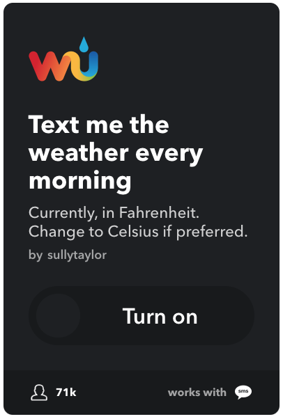
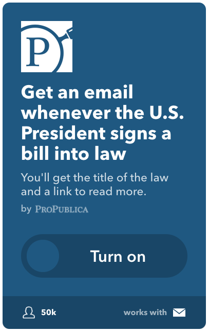

One of the great trends that has come out of the past few years of technological advancement is the move towards simplifying previously complex tasks for folks who don't want to write code. This simplification opens the door for people to use technology in new and inventive ways, spanning from DIY home automation all the way over to activism. I'd like to touch a bit on the activism side today - an aspect of advancement that seems to be needed now more than ever.

Supporting organizations like the [ACLU](https://aclu.org) or the [Souther Poverty Law Center](https://splc.org) has been at the top of my list for quite some time, but actually donating always depended on me going to the site and filling out the form when I wanted to provide financial support. A recent conversation about donating every time something gets mentioned in the news spurred me to look for automation alternatives for this task.

  
  <a href="https://www.flickr.com/photos/68751915@N05/6281020696/in/photolist-az2SCh-bn4oq2-d3koK-7xFCXW-5QKWwC-aFAPtx-7xFvR7-fBsQs-f9ZEG-62QVKf-713m5r-659Rgz-aFDgrH-ad9aU-nTZJp-bjoEy4-ebifU-kyBTGB-fdHEa-6TjBCF-QxcaH-5FPV63-donZN-2abVs-s6895e-biaRHp-snzBqK-s4fksR-s61m4j-s61ncG-JCQG88-cNdyo-bu6pKh-s5ZdWJ-bu6sBd-snzAJp-s61ku3-skhAfL-smQwn4-rqLAHi-s688Fi-s684tk-pYSVGy-snzzza-snxbdk-s685Wv-vFBXwb-chEejy-aYWfHD-aFDkRt" target="_new" class="image-caption">Photo by 401(K) 2012</a>

I wanted something that didn't require a lot of overhead to run, and something that could be easily updated as-needed. The obvious choice was to use IFTTT (If This Then That) - a plug-and-play service that drastically simplifies trigger-based actions.

### You'll need a few things to get started

First things first, you'll need a free IFTTT account to get up and rolling. Head over to <a href="https://ifttt.com/join" target="_new">ifttt.com/join</a> to sign up. Once you're signed up, you're ready to create your first applet. "Wait, applet sounds pretty 'code-y', and you said no code!" Regardless of the name, there is still no code involved in this - an applet is just a collection of actions that you want to take based on some event happening. What that event is listening for is up to you, and you have a ton of services that can tie into IFTTT that will help you create yours. Some fun examples are having <a href="https://ifttt.com/applets/24908p-text-me-the-weather-every-morning" target="_new">IFTTT text you the weather on your way out every morning</a>, or having <a href="https://ifttt.com/applets/152298p-get-an-email-whenever-the-u-s-president-signs-a-bill-into-law" target="_new">ProPublica send you an e-mail every time the President signs a bill into law</a>.

  

    
    <a href="https://ifttt.com/applets/24908p-text-me-the-weather-every-morning" target="_new" class="image-caption">Weather Applet</a>
  

  

    
    <a href="https://ifttt.com/applets/152298p-get-an-email-whenever-the-u-s-president-signs-a-bill-into-law" target="_new" class="image-caption">ProPublica Applet</a>
  

The next part that you'll need is a <a href="https://www.qapital.com/" target="_new">Qapital</a> account, which you'll need to sign up for via your smartphone. Qapital is a very similar service to IFTTT, but it integrates with your bank account to help automate your savings. I have an applet running on there than automatically rounds up to the nearest dollar for every one of my debit card purchases, and then puts that money  into a vacation savings account. Once you've set up a Qapital account, you'll need to connect your bank account to it. This will be the account that it draws out of to put money towards your donation.

#### Creating a donation Qapital goal
Now that you're up and running on Qapital, you'll need to set up a goal for your target donation. I started with $50 towards the ACLU, but you can do this for any cause or savings goal. This is probably a good time to point out that you don't have to use this for donation purposes - this would also be great if you're just trying to control your savings a little more.

#### Connect IFTTT to Qapital
Jump back over to IFTTT, and then go to the <a href="https://ifttt.com/qapital" target="_new">Qapital Service page on IFTTT</a>. Click connect, and then log in with your Qapital account. Just like that, you're ready to create your first applet with Qapital and IFTTT.

#### Find your news source
We need a concise text-based source to "listen"" to in order for this applet to run. I chose to use the <a href="http://rss.cnn.com/rss/cnn_allpolitics.rss" target="new">RSS feed from CNN Politics</a>. We'll stick with RSS feeds for this tutorial - keep in mind that you can use any RSS feed you find. What we'll be doing is listening for a specific word in the feed that will trigger our applet to run. Once you've found your RSS feed, head back over to input your feed's details in IFTTT.

#### Creating your first applet

  
Click <a href="https://ifttt.com/create" target="_new">New Applet</a> on IFTTT to start building your first applet. The formula is as simple as the name - if "this," then "that." For the "this" side, we'll be using IFTTT's RSS service. Click "this" and select the orange "feed" icon. We're listening for a word, so select "New feed item matches." Here, you'll input whatever word you want to listen for, and the link to the RSS feed that it will pull from. Keep in mind that this will only be looking at the headline and a quick intro to the story, so you'll want to keep your trigger word short and specific.

  

  
    
    <a class="image-caption">IFTTT Feed Icon</a>
  

Now that you've got the "this" side down, we'll tackle the "that" side. Click on "that" and choose your Qapital service. Since this is on the action side, we only have one action available - save towards a goal. This will pull in your list of goals from Qapital. Choose the goal that you set up to save towards your donation. You can choose how much you'd like to save towards your goal every time the applet runs.

$1 is a great place to start out if you're concerned about this getting out of hand, but remember, the applet will only run until you hit the goal that you set in Qapital. For instace, if you set a $10 goal of saving a dollar towards a donation to the <a href="http://www.ctunet.com/" target="_new">Chicago Teachers Union</a> every time Betsy DeVos gets mentioned in the news, you would quickly hit your limit on a high-traffic day like today, when she was successfuly appointed by the Senate. No need to worry, though, once you hit your goal, your applet will stop running automatically.

### Now actually donate the money
Automation like this is great because it never sleeps or misses an important news story. Unfortunately, we still have one human-involved step in this process to get the money to the place that you'd like to donate. Once you reach your goal in Qapital, you'll need to transfer the money over to your bank account and then actually make the donation yourself. This definitely isn't ideal, but it's a step in the right direction to regularly donating.

#### Next steps and improvements
I'd love to see a way for IFTTT to automatically make that donation for you, but as of now I haven't found a way to do that. Qapital is a great service to build your savings, but the money does sit in a Well Fargo account until you actively move it out. The upside of this is that your savings are FDIC-insured, the downside is that it's through <a href="https://en.wikipedia.org/wiki/Wells_Fargo#Controversies" target="_new">Wells Fargo, a historically shady bank</a>. Because of this, I would suggest moving the money out ASAP after you've hit your goal. This can also be aided by setting smaller goals and donating more frequently. Qapital makes their money by keeping your funds in that account and accruing interest on them while it's there, so really it's in your best interest (har har) to move it to your own interest-accruing account frequently. The tricky bit is that they won't let you transfer until you've hit your goal - if you decide that you want to move the money before you've reached your goal, you can edit the goal to match whatever amount you have in the account, and then go ahead and transfer it. Is it perfect? No. Is it a step in the right direction? I hope so. If you'd like to suggest that Qapital moves away from banking with Wells Fargo, I'd encourage you to make your voice heard by dropping them an <a href="mailto:hello@qapital.com?subject=Why Wells Fargo?" target="_new">e-mail</a> or a <a href="https://twitter.com/qapitalapp" target="_new">Tweet</a>.
