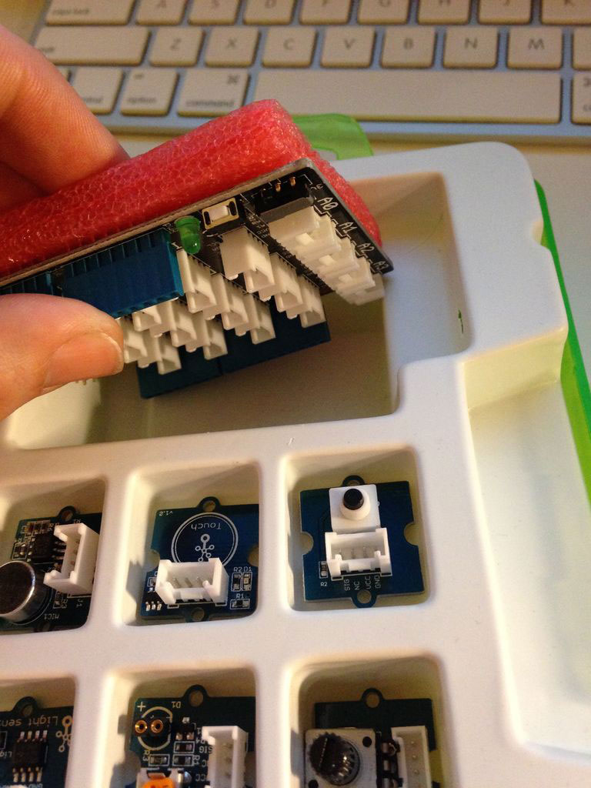
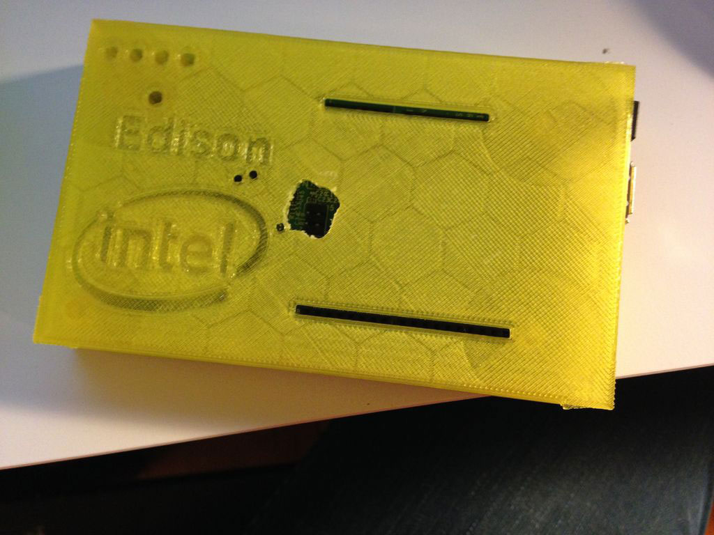
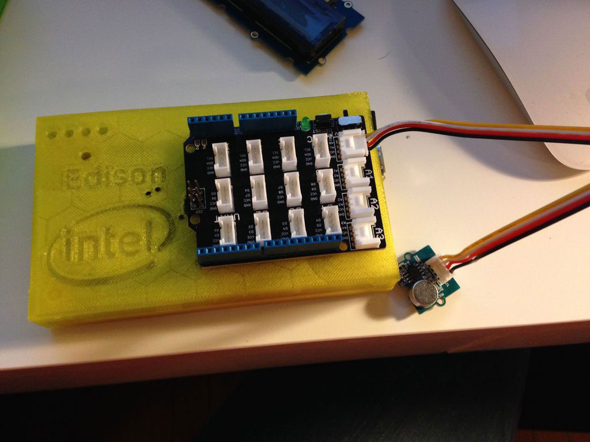

A couple of years ago my landlord informed me that the shop that I was living behind would be expanding in to my apartment. He wasn't sure of the exact timeline, but he was sure of the fact that we would need to move in the near future. This was the first apartment that my girlfriend and I rented together&mdash;and our first "real" Chicago apartment&mdash;you can imagine how bummed we were. To soften the blow, we decided that we would start looking for an apartment that would allow a dog.

<div class="image-container large-image">
  
  <a href="http://www.aefischer.com/pets/" target="_new" class="image-caption">A Photo of King by Ashley Fischer for the Warm Noses Project</a>
</div>

A few weeks later, we ended up with King, the big lug of a dog that you see pictured above. He's a pit mutt that we managed to pick up from the <a href="http://www.cityofchicago.org/city/en/depts/cacc.html" target="_new">Chicago Animal Care and Control</a> kennel 48 hours before he was set to be euthanized. The decision, albeit rushed, was a good one in the long run–King is a great dog.

With that said, one of King's favorite pastimes is barking in the house while we're out. Squirrels, cars, people in the hallway–if it makes a noise while we're out, King is on it. I decided to run a few experiments by tracking his barking to see what we could do to quiet him down a bit.

I ended up using the <a href="http://www.intel.com/content/www/us/en/do-it-yourself/edison.html" target="_new">Intel Edison</a> to log King's barking patterns. My thinking was that the Edison would use a small mic to listen to the room for loud noises, and then when it registered a noise, it would send that data to a feed on <a href="https://data.sparkfun.com/" target="_new">data.sparkfun.com</a>.

### Here's how to make your own bark tracker

The Edison is really good at a lot of things, and one of the things that excites me the most about it is its ability to run Node.js. The only big downside of the Edison is that it's a little tricky to get started if you're still a greenhorn, but it's nothing that you can figure out with a little persistence.

#### Setting Up the Edison
Full disclosure&mdash;I'm working on a Mac, so these instructions will skew that way. To get started, you should have a <a href="https://communities.intel.com/docs/DOC-23193" target="_new">freshly-flashed Edison</a>. After you board is flashed, you can try to find the IP address and enter all the additional commands, or you can just "npm install bloop" on the machine that you're trying to SSH in from. <a href="http://rexstjohn.com/introducing-bloop-cli-commands-for-working-with-intel-edison/" target="_new">Bloop is a tool</a> from <a href="http://rexstjohn.com/" target="_new">Rex St. John</a>, and it's an absolute lifesaver when you're working with the Edison. Instead of running "screen /dev/cu.usbserial-XXXXX 115200 -L", all you have to do is run "bloop c" it will connect to the Edison it finds on your network. Once you're in, run "configure_edison --setup" to get your wi-fi and user creds defined.

While all this is happening, you can start downloading the Edison Yocto Image from <a href="https://communities.intel.com/docs/DOC-23242" target="_new">this site</a>. You want the link that says, "Edison Yocto Complete Image." Once downloaded, you'll need to load the files onto a micro SD card–you can read up on Yocto and how to get those files onto the SD card <a href="https://software.intel.com/en-us/html5/documentation/getting-started-with-intel-xdk-iot-edition" target="_new">here</a>. After you load the files, power down your Edison, insert the SD card, and the power it back up. To test your install is working, bloop in to your Edison and type "node -v". If that returns the version of Node that you have installed you're good to go. If it says "Command not found," you're going to need to try loading Yocto onto the SD card again, because something went wrong.

#### Hook Up Your Sensor
<div class="paragraph-with-picture left">
	<p>At this point in the build, you'll need to hook up whatever kind of sensor you're using. I was fortunate enough to receive a <a href="http://www.seeedstudio.com/depot/Grove-Starter-Kit-p-709.html" target="_new">Grove Starter Kit</a> from Intel and Instructables, so I'll be talking about my experience with that. First pro-tip is that the connector shield is located on the back of the red anti-static foam, under the LCD screen. I may or may not have made it all the way to ordering a connector shield on Amazon before errantly knocking the starter kit case over and realizing that there was a shield already in the kit. It was early. I hadn't made coffee yet.</p>

  <div class="image-container small-image">
    
    <a class="image-caption">Finding the Grove connector shield</a>
  </div>

</div>

<p>I 3D printed a case for my Edison using <a href="https://www.thingiverse.com/thing:457434" target="_new">a design from Thingiverse</a>. The case uses the screws for the struts to secure the lid, and has two slots for the shield pins to go through. I did have to drill an extra hole in the lid for the ISP pins, but other than that everything fits great.</p>

<div class="image-container large-image">
  
  <a href="http://www.thingiverse.com/thing:457434" target="_new" class="image-caption">3D Printed Intel Edison Case by Michael Jassowski</a>
</div>

Power down your Edison, and then attach the Grove Connector Shield. Once you have your shield attached, grab a connector and attach your sound sensor to the pin marked "A0" (analog 0). Once that is securely connected, go ahead and power up your Edison again.

<div class="image-container large-image">
  
  <a class="image-caption">My Edison with the mic hooked up to A0</a>
</div>

It should be noted that while the Grove Starter Kit is a nice to have, you don't really need to worry about not having it. Get a sensor, solder some wires on, and hook it up straight to the pins on the Arduino–it's all the same thing.

#### Create a Feed on data.sparkfun.com
Before we start writing the code, we're going to need some place to put all this tasty, tasty data that we'll be collecting. I decided to use <a href="https://data.sparkfun.com/" target="_new">data.sparkfun</a> for its ease of use. You'll need to create a feed–<a href="https://data.sparkfun.com/streams/make" target="_new">follow this link to do that</a>.

While you're setting up your feed, you need to decide what it is that you'll be tracking. You can add these items in the fields section. For my build, all I need to track is the level of noise. Sparkfun automatically adds a timestamp for you, which is the other piece of data that I'd like to collect.

Once you've created your feed, keep the window open so you have easy access to your public and private keys–you'll need those in the next step.

#### Set Up Your Dev Environment
Now that your sensor is plugged in, power your Edison is powered on again. Once it's booted up, run "bloop c" from Terminal on your computer to SSH into your Edison. Once you're in, make a new directory for your project in your root folder. Grab the contents of my <a href="https://github.com/justinisamaker/arduino/blob/master/barkTracker/package.json" target="_new">package.json file</a>, and then run "npm install" from the root directory. This will install Forever, Moment, Moment Timezone, and Request, as well as any dependencies that they have.

### Time to write some code!

The code we're writing is fairly simply. All we're going to do is listen to the sensor, and when we hear a noise above a certain level, send the data off to our feed. You can find the code on my <a href="https://github.com/justinisamaker/barktracker" target="_new">GitHub</a>, but I'd much rather you read through the code below and see what's going on.

```javascript
// Require libraries
var m = require('mraa');
var request = require('request');
var moment = require('moment');
var momentTimezone = require('moment-timezone');

// Do a sanity check to make sure that MRAA is loaded
console.log('MRAA Version: ' + m.getVersion());

// Declare your sensor as an analog input
var soundSensor = new m.Aio(0);

// Set the sound threshold
var threshold = 800;

// Run the function to start out
checkSoundLevels();

// Declare the sound check function
function checkSoundLevels(){
  // read the value to start off
  var soundValue = soundSensor.read();

  // Log the value to see where you need to set the threshold–uncomment this line to debug
  //console.log(soundValue);

  // If the sound is higher than the threshold, make the request
  if(soundValue >= threshold){
    // Set the current time with my timezone, format the date and time
    var currentTime = moment().tz("America/Chicago").format('HH:mm:ss–MM/DD/YYYY');
    // Use the request library to hit the Sparkfun URL–make sure you replace the applicable parts with your data
    request('http://data.sparkfun.com/input/[INSERT PUBLIC KEY]?private_key=[INSERT PRIVATE KEY]&soundlevel=' + soundValue + '&localtime=' + currentTime, function(error, response, body){
      console.log(response.statusCode);

      // If the response is good, wait 10 seconds before we start checking again
      if(response.statusCode === 200){
        console.log('posted successfully with a sound value of ' + soundValue + ' at ' + currentTime);
        setTimeout(function(){
          setTimeout(checkSoundLevels, 100);
        }, 10000);
      } else {
        console.log('oops, there was an error');
        console.log(response.statusCode + ' :::: ' + response.body);
        setTimeout(checkSoundLevels, 100);
      }
    });
  } else {
    setTimeout(checkSoundLevels, 100);
    // console.log(soundValue);
  }
}
```

When you look at the code, you'll need to find the spot that says "[YOUR PRIVATE KEY]" and "[YOUR STREAM ID]" and replace those with the info that you got from Sparkfun when you set up your stream.

#### Run Your Code
Once everything is loaded and configured, navigate to the root folder of your project, and run "node whateverYouNamedYourFile.js". If you left the console.logs in, you'll see the data start to come through the terminal. Adjust your threshold to your liking, then make a loud noise and go check to see that it updated on Sparkfun. If you see the data on Sparkfun's website after a refresh, you got it right. If you don't see the new data coming in, double check that you entered your stream's ID, private key, and data fields correctly. Also take a look at the console output after your run node on your file–the logs there may help you debug your code.

#### Experiment Results
I was constantly refreshing the data.sparkfun feed the first few days that I was running the tracker. Much to my dismay, the tracker was logging a noise almost every five minutes. I came home ready to go apologize to my neighbors for my unruly dog and swear to them that he doesn't do this while we're home. The third day that I ran it, I left it running while I took King out for a walk when I got home. When I came back in, the tracker had been registering the entire time that we were gone. After a little threshold adjusting, I was able to hone in on the right values and get a good read. Turns out that he was only barking a few times a day, and a little white noise in the apartment reduced that even more.
