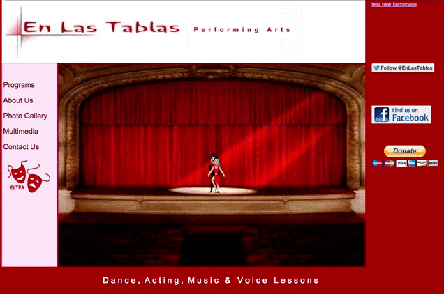
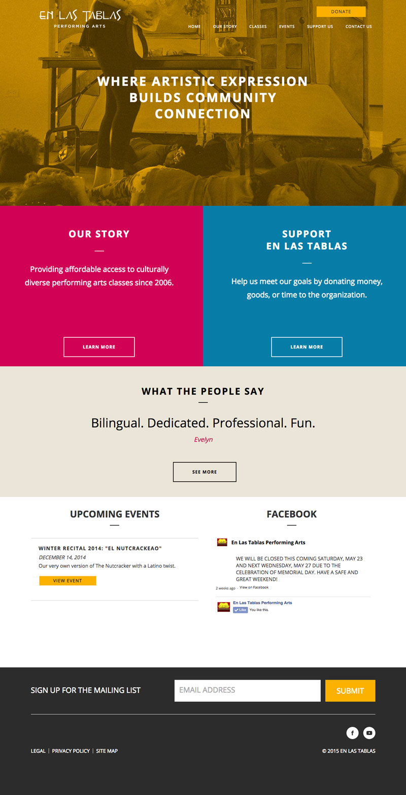
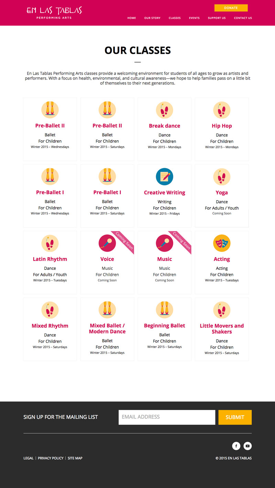

En Las Tablas is a wonderful non-profit that operates in the Hermosa neighborhood of Chicago. The organization focuses on providing much-needed arts education to kids in the surrounding area - something that they usually aren't getting at school due to severe underfunding.

I got involved with En Las Tablas through the Nerdery's Overnight Website Challenge. I convinced a group of 9 of my colleagues from Critical Mass to stay up for 24 hours attempting to build and launch a website for a non-profit that needed one. We were paired with ELT during the speed dating portion of the event that took place a week before the kickoff - we had an instant connection with the two ladies who run the organization, and we were thrilled to work with them.

  
ELT was a little unique in regards to the event's participants in that they already had a website. The website was built by a relative of one of the organizers, and had not been updated in some time. While they were grateful for the existing site, it was definitely time for a face lift.

  

    
    <a class="image-caption">ELT's Old Website</a>
  

We built the site on Wordpress in order to make it easy for them update it with the latest courses and events. The more we dug in to their business plan, the more we realized that a good website could make their lives a lot easier.

Before the website, events were announced to the parents who had children enrolled. When they wanted to buy a ticket or pay for a class, they had to come in to the studio and fill out a form that had been xeroxed-to-death, and then pay in cash. This left the studio holding a good amount of cash, which is something that they were considerably stressed about. Everyone knew that they had cash on hand - if they were robbed, there was a good probability that the studio would need to shut down.

We were able to move their event and class scheduling system over to Eventbrite, as well as set up an e-mail blast for them in Mailchimp. This let them easily update and spread the word about their classes, but it also took the onus of charging for the classes off their hands. They were now able to send e-mail blasts letting people know about new offerings, even if the person didn't have kids currently enrolled in a class.

  

    
    <a class="image-caption">En Las Tablas Home Page</a>
  

  

    
    <a class="image-caption">En Las Tablas Class Listings</a>
  

