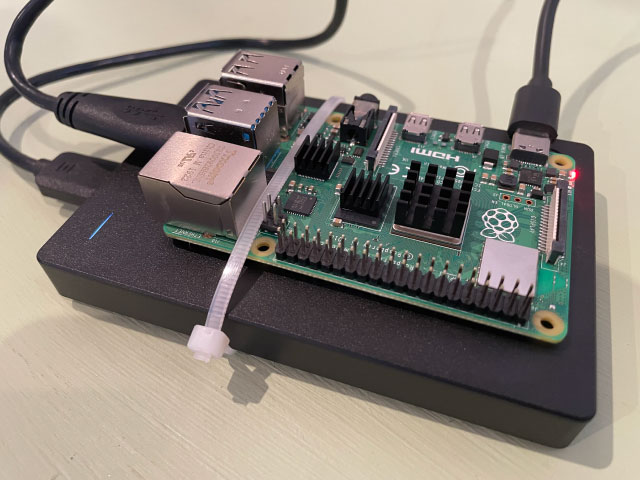
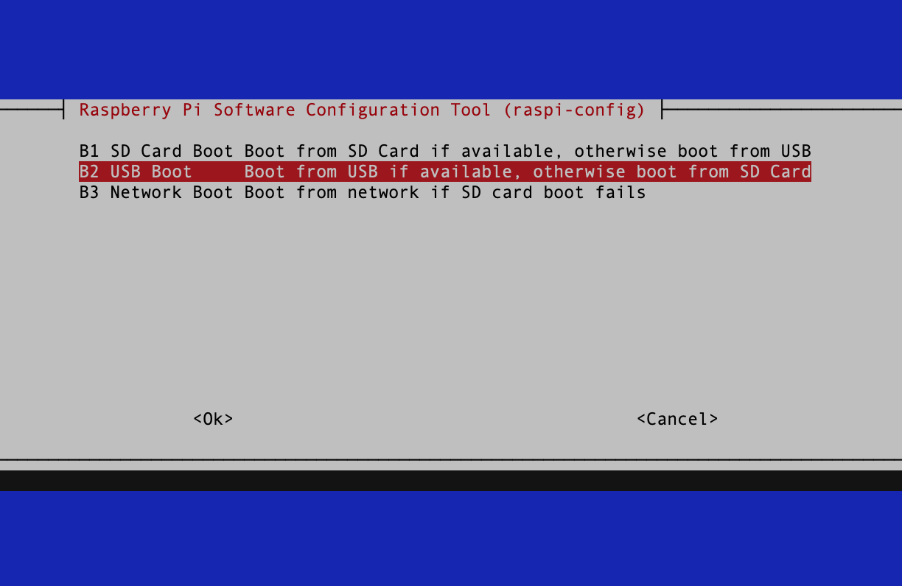
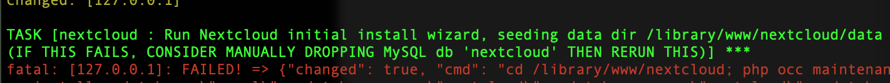
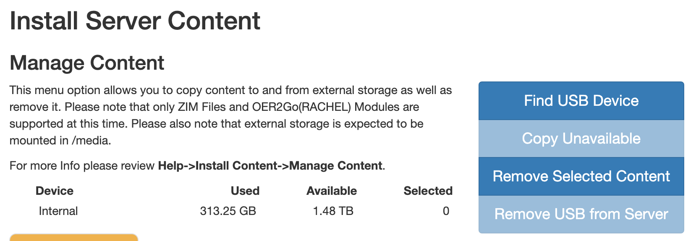

The <a href="https://github.com/iiab/iiab" target="_new">Internet in a Box project</a> provides a suite of tools and knowledge that can be accessed even if you don't have internet connectivity. Their project page bills it as a "free Digital Library of Alexandria." When I bumped into their project on <a href="https://news.ycombinator.com/item?id=27568332" target="_new">Hacker News</a>, I knew that I had to get one set up. I live in a place that's frequently affected by hurricanes, and much like the rest of the population in a post-2020 world, preparedness has been more on my mind lately. There is some valuable emergency-related material that you can install on the box, but it's also just a good source of entertainment and information if the internet does go down for a prolonged period of time. 

IIAB is built to run on any UNIX-based device, which makes the Raspberry Pi a great candidate for a host. I chose to build mine on a Raspberry Pi 4 Model B. This lets me run the IIAB project as a full desktop if I'd like to, or just utilize the option to run the Pi as an access point in order to access it via other devices.

  
  <a class="image-caption">Internet in a Box running on a Raspberry Pi</a>

I started by using one of IIAB's pre-formatted SD images, but quickly realized that I wanted more space to store content than was available on my SD card. High-capacity SD cards exist, but the price skyrockets fairly quickly with the amount of storage, and I was trying to set this project up with stuff that I had laying around. I decided that I'd use a spare external hard drive that I had to expand the storage capacity instead. Sounds easy, right? Nope. Turns out that IIAB will let you copy things over to a drive, but actually letting it use the drive as its base storage was a little more complicated. There is some documentation on their site for how to do this, but that didn't work for me. I ended up replacing the SD card with the entire system mounted onto the hard drive, which also allowed me to utilize the full 2T for the project's storage. 

### Booting Your Raspberry Pi from a External Drive
After I hit the issues with IIAB not wanting to install content anywhere else besides the 16GB SD card, I decided to just run everything from the hard drive. You'll still need a MicroSD to start, but once you get everything set up, you'll be able to ditch the SD and run your Pi exclusively off the hard drive.

This portion of the process is specific to Raspberry Pi 4 Model B's and later, or any other BCM2711-based devices. If you're using an older Pi, your sequence to complete this step will look different.

To start, you'll need a SD card with the latest version of Raspbian on it. Do not use NOOBS–it will not work with IIAB. You can get that by using the <a href="https://www.raspberrypi.org/software/" target="_new">Raspberry Pi Imager</a>.

Go through your usual Pi setup, and then attach your hard drive to your Pi and power everything up. You'll need to be able to get to `raspi-config` on your Pi, which means you'll either need to be able to SSH/VNC into it, or have access to a screen and keyboard. 

  
Once your Pi is booted up, run <code>sudo raspi-config</code> or open the config tool via the GUI if you're using a screen. The specific option that we're looking for is under <code>Advanced Options > Boot Order</code>. We want our Pi to boot from the USB, so we select "USB Boot".  <em>Do not reboot your Pi!</em> Before we reboot, we want to copy our Pi's card over to our external hard drive.

  

    
    <a class="image-caption">Selecting USB Boot from Raspi-Config</a>
  

I used the <a href="https://www.raspberrypi.org/blog/another-update-raspbian/" target="_new">SD Card Copier tool</a> on Raspbian to clone my SD to my HD. If you are working with a Raspbian without a desktop, or if you don't have access to something that will let you see the desktop, you may be able to run this part with <a href="https://github.com/billw2/rpi-clone" target="_new">RPI-Clone</a>, but using the visual tool is how I did this for my own instance.

Open the SD Card Copier by going to Accessories in the main Raspberry Pi menu. You want to copy from your Micro SD Card (probably `/dev/mmcblk0`) to your external hard drive (probably `/dev/sda`). Once your card has finished copying, shut down your Pi, remove your MicroSD card, and then turn your Pi back on. It should boot straight from the hard drive now. If something in this process doesn't work for you, I followed <a href="https://www.tomshardware.com/how-to/boot-raspberry-pi-4-usb" target="_new">this guide from Tom's Hardware</a> the first time I was setting my hard drive up, and there may be an answer for you there.

### Installing IIAB
Since we did a little bit of configuration on our own to boot from the HD, we aren't able to use the pre-fab SD image of IIAB. Instead, we'll use the curl command listed in <a href="http://wiki.laptop.org/go/IIAB/FAQ#Is_a_quick_installation_possible.3F" target="_new">their FAQ</a>.

Run `curl d.iiab.io/install.txt | sudo bash` on the Pi to get the latest pre-release of IIAB. As noted in their docs, this step can take a long time to complete depending on which size of installation you choose when prompted after running the curl command. It's also strongly recommended to be connected to a fast network via ethernet for this step. I went with a medium-sized installation, which gets you all of the basic tools like WordPress and NextCloud, but leaves off some of the heavier items like the Internet Archive's Wayback Machine, phpMyAdmin, and VOIP tools. If you're unsure about which size you want to install, make sure you check out <a href="http://wiki.laptop.org/go/IIAB/FAQ#What_services_.28IIAB_apps.29_are_suggested_during_installation.3F" target="_new">the comparison table</a>. 

### Troubleshooting the One-Line IIAB Install
They aren't kidding when they tell you that you may need to run `sudo iiab` multiple times to get the installation to run successfully. Keep an eye on your console output, and make sure that you start the process again with that command if the process dies.

I had a particular error with NextCloud's installation that required me to jump into MySQL to fix it. 

  
  <a class="image-caption">SQL error regarding NextCloud during install</a>

To fix that error, login to MySQL by running `sudo mysql`. Once logged in, check that the NextCloud database exists by running `SHOW DATABASES;`. If it's there, delete it by running `DROP DATABASE nextcloud;`, exit MySQL, and then run `sudo iiab` to attempt the installation again.

### Logging In and Installing Content
Once your installation successfully completes, you should be able to access your IIAB by pointing a browser at `box.local`. You can find the <a href="http://wiki.laptop.org/go/IIAB/FAQ#What_are_the_default_passwords.3F" target="_new">default passwords here</a>, and should immediately change them as well as your Pi's password since this project is connected to the internet. 

Your IIAB dashboard is accessible at <a href="http://box.local/admin/" target="new">http://box.local/admin</a>. You can find available content by navigating to the "Install Content" menu to browse through ZIM files and OER2Go modules. With your external hard drive running the entire installation, you should have ample space to install information to your heart's content. To verify that your storage is hooked up correctly, you can go to "Manage Content" inside the "Install Content" menu to see your available space.

  
  <a class="image-caption">Manage content screen showing available space</a>

If you're on an internet plan with data caps, it may make sense to space your usage out over a few billing payments - it's pretty easy to get carried away and download hundreds of gigs of content. There's a lot of really great stuff available to install. The medium installation gives you tools like WordPress and NextCloud if you're using the project for more long-term information sharing. I also grabbed the entirety of Wikipedia, a few medical guides, the CDC's website, satellite imagery and OpenStreetMap data of North America, Project Gutenberg, a bunch of TED Talks, lots of archived StackOverflow sub-sites, and RadioLab recordings. In reality, this will probably only be used for entertainment during extended power outages, but it's nice to have on hand if you already have a spare Pi and hard drive that you aren't using. 