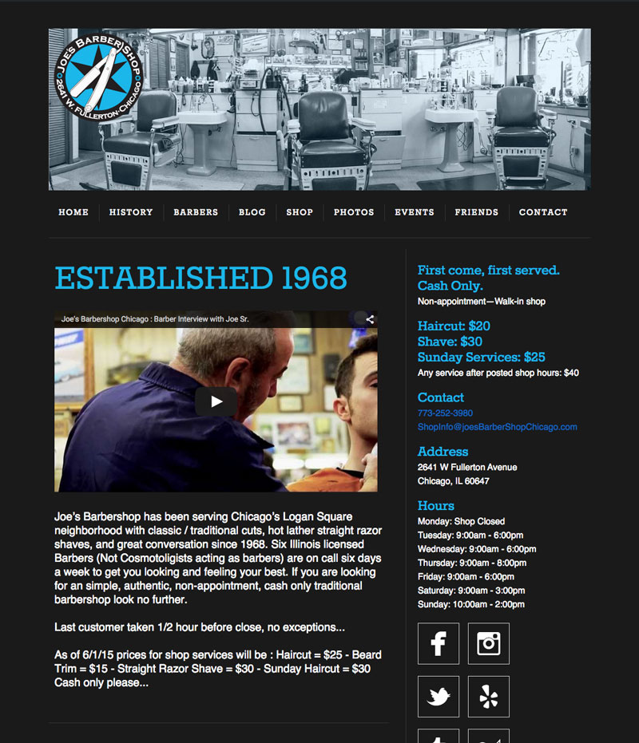
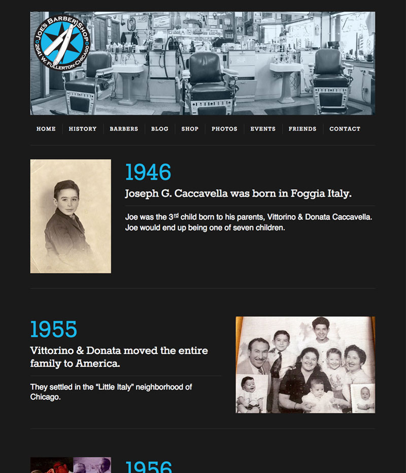

People come from far and wide to get their hair cut at Joe's. The shop has been in Logan Square since 1968 when Joe Caccavella, Sr bought out the barber he was working under after he came back from the Army. Over the past 47 years, Joe Sr and his son Joe Jr have evolved the shop into an empire that completely destroys any competition stupid enough to rear its ugly head.

Joe's came into my life much, much later than 1968 through my buddy Ralph Holcomb. Ralph is a wonderful barber here in Chicago who helped me find my first apartment, which coincidentally happened to be behind Joe's. I talked with Joe Jr, and after a quick discussion and a handshake I was moved in to the apartment on the other side of the wall.

Joe Jr led the charge to really put the shop on the map with the younger generation. Joe Sr, aka "Papa Joe", had a great roster of regulars, but Joe Jr wanted to get the younger guys in the shop. He mounted a full-fledged media campaign to get their name and their outstanding reputation out to a new audience, and boy did he do a good job. The shop has been voted the best in Chicago for five years running now, and with a new expansion into what used to be my apartment, there's no sign of them slowing down.

While Joe Jr was planning his strategy to overtake the barber world, I was rebuilding their site for them. Joe is a no-nonsense guy, and he wanted a no-nonsense website. Straightforward, clean, and easy to find the info that you need. I wanted Joe to be able to have as much control over the website as he could so that he didn't have to wait for me when he wanted to make a change. To facilitate that, I built him a custom Wordpress theme from the ground up and rigged everything up with Advanced Custom Fields and Repeaters so that he can edit anything on the site without having to know any code at all.

  

    
    <a class="image-caption">Joe's Barbershop Home Page</a>
  

  

    
    <a class="image-caption">Joe's Barbershop History Page</a>
  

