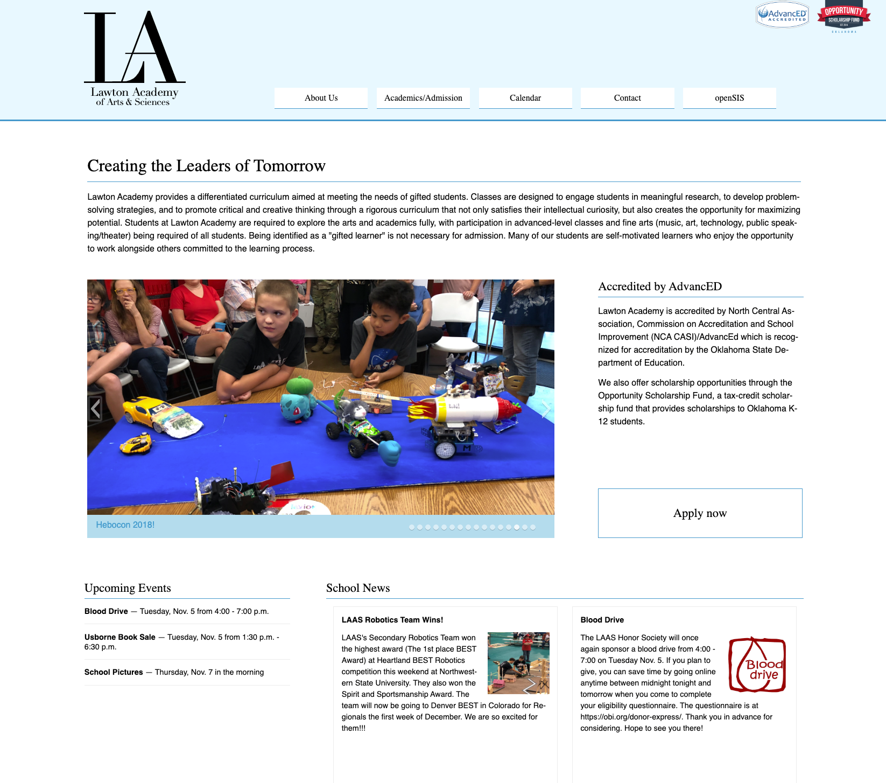

Education is hard–there’s no two ways about it. I’ve only dipped my toe into the education arena through a few very limited engagements, but it’s been enough to reinforce the diehard gratefulness that I have for folks who were called to that line of work. My support of educators is also rooted in the fact that I come from a family chock full of them–I’ve got six in my immediate family! The majority of them teach at a small K-12 school in Southwest Oklahoma called the Lawton Academy of Arts and Sciences.

The school was founded by my grandmother in 1999–she had just retired from a fifty-year career in various roles with public schools in Lawton. Her career culminated with her serving as the superintendent of a magnet school. People from the community came to her when she retired and asked her to start a non-religiously-affiliated private school. At the time the only options for private education in Lawton were Catholic or hardline Southern Baptist schools, and the town was losing people like surgeons and engineers that didn’t want to put their kids into that kind of education.

The website for the school had been through a lot of iterations before I took it over. A few of the teachers were trying to rely on that famous Okie stubbornness to make a site generator stretch significantly farther than it was supposed to, but ultimately they were working harder than they needed to. I rebuilt the website for them with a custom WordPress theme and Advanced Custom Fields integration that made it easy for anyone at the school to make sure that the information was up-to-date and relevant.

  
  <a href="http://lawtonacademy.com/" target="_new" class="image-caption">The Lawton Academy Website</a>

