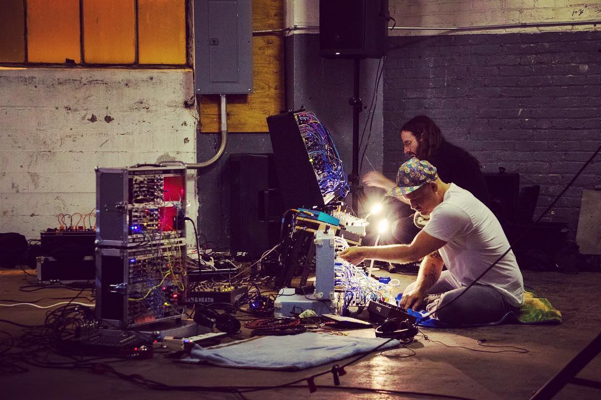
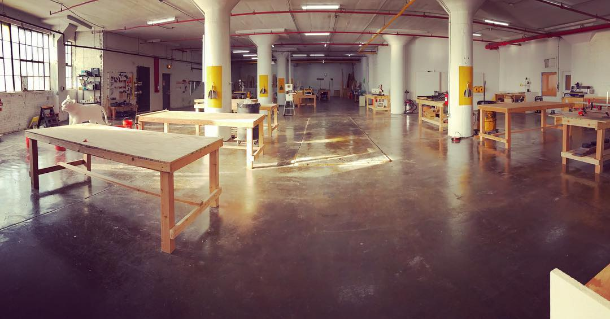
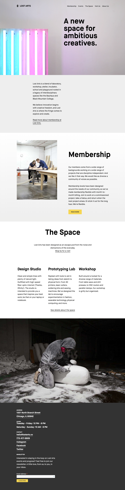

One of the advantages of living in Chicago is the amount of options that you have access to. It’s not New York or Los Angeles, but more often than not you’re still going to have choices when it comes to most things. Makerspaces are no exception here–we have a plethora of spaces to choose from, and all of them are extremely different. Out of all of the iterations of spaces that I’ve seen in Chicago, Lost Arts has been my favorite. It struck a nice balance between a traditional makerspace and a coworking space, and it definitely drew the right crowd if you were interested in making awesome things in Chicago.

  
  <a href="https://www.instagram.com/p/BKwVerVgBDg/?taken-by=lostarts" target="_new" class="image-caption">Synth Workshop and Concert at Lost Arts</a>

Lost Arts was founded in 2015 by Charles Adler, one of the co-founders of Kickstarter. The first version of the space was a month-long experiment housed in a recently-sold meat processing warehouse in the West Loop. I say experiment because that’s exactly what it was. Charles loves building communities and enabling folks to create, and that first iteration was him dipping his toe in the water to see if he could actually pull it off. The first iteration ran over the summer of that year, and brought together a who’s-who of the creative community in Chicago to make things together. There was no charge for participation or use of the tools–the only constraint was that the building would be torn down at the end of the month to make way for condos. I was able to help by keeping the fleet of 3D printers maintenanced and running, and it was off to the races for us.

  
Charles and I clicked, and I started seeking out other ways that I could help make sure that the experiment succeeded. One of the obvious ways that I could help was by creating a website for the space. The website for Lost Arts needed to reflect the vibrant and diverse community that gathers at the space, but it also needed to be easily maintained by folks who never wanted to touch code. As with many of my other projects, we decided that WordPress was the right tool for this job.

  

    
    <a href="https://www.instagram.com/p/BN-FHivhARj/?taken-by=lostarts" target="_new" class="image-caption">The wood shop side of Lost Arts</a>
  

The second iteration of Lost Arts reopened in a recently vacated warehouse on Goose Island in 2016. The space was previously used as document storage for Pickens Kane, and had been purchased by R2 Property management–the same company that owned the lot that the first Lost Arts was on. The new space was absolutely massive, and provided a great place to explore what a coworking space would look like if you could also run a table saw in it.

Out of all of my projects, this site has probably seen the most drastic changes over its lifetime. Charles has a drive to always make things better, and the website doesn’t escape that reach. We launched three major versions of the site as the space was evolving and expanding. The design always represented what Lost Arts was about at that particular moment, and it shipped with a water-tight custom fields and post types implementation that let our content editors easily update the site with very little fuss.

Unfortunately Lost Arts closed its second iteration in the fall of 2018. I no longer run the website, and it is now updated to reflect the next phase of Lost Arts, whatever that may be. Here’s to hoping that it comes back somewhere in the near future–I’ve never found a better place to make work in Chicago.

  
  <a class="image-caption">The Lost Arts homepage during the second iteration</a>

 
