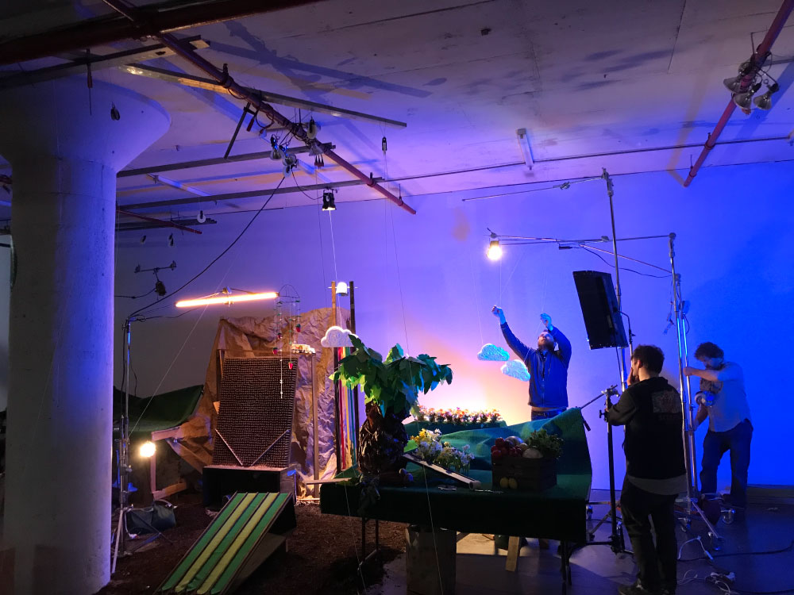

The 2017-2018 winter in Chicago wasn't particularly brutal, but every Chicagoan is always keenly awaiting that first day of spring when you can walk outside without the air hurting your face. Just as we were entering the last throes of winter, <a href="http://www.thehoyde.com/" target="_new">Steve Delahoyde</a> contacted me asking if I could help him build a giant Rube Goldberg Machine focused on the topic of spring on the farm. What better way to welcome the season?

  
  <a class="image-caption">An action shot from the production</a>

I found Steve's work from some of the <a href="https://vimeo.com/260596853" target="_new">excellent films he made for Field Notes</a>, so working together was an absolute no-brainer. He had been contacted by a restaurant group out west called Lazy Dog. They wanted a promotional video that would let them show how the changing seasons impacted our food growth. They also wanted to shoot in three weeks, which gave me an extremely short timeline to get the whole thing built and tested. Building a RGM was on my bucket list, though, so how could I possibly turn this down?

  
  <a class="image-caption">Sketching out the plans for the machine</a>

We were definitely flying by the seat of our pants, but I was able to get everything built and working just in time for the shoot. The production didn't escape the deadline pressure, though - we assembled the entire machine, shot all of our takes, and tore everything down in one 23-hour stretch. Was it worth it? Absolutely. The client was a joy to work with, and the video turned out great. Make sure to check out the <a href="https://www.lazydogrestaurants.com/blog/mother-nature-the-ultimate-machine" target="_new">full write-up on Lazy Dog's website</a>, and don't forget about the <a href="https://vimeo.com/269765297" target="_new">behind-the-scenes video</a>!

<iframe src="https://player.vimeo.com/video/269759059" style="position:absolute;top:0;left:0;width:100%;height:100%;" frameborder="0" webkitallowfullscreen mozallowfullscreen allowfullscreen></iframe>
 
