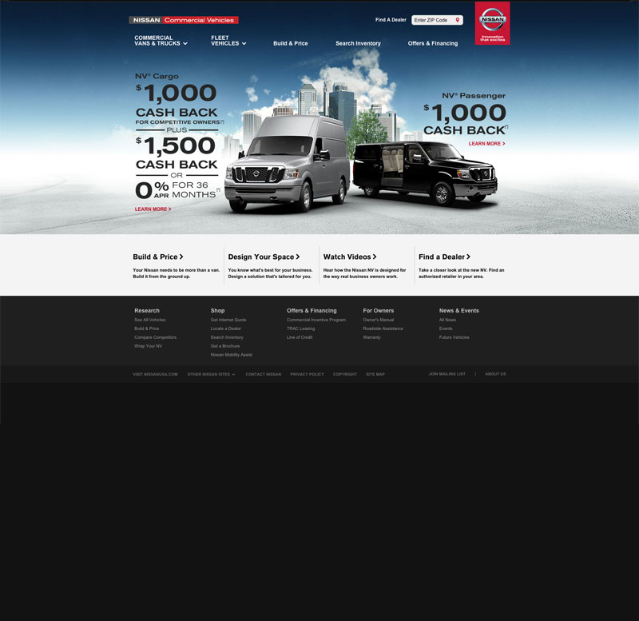
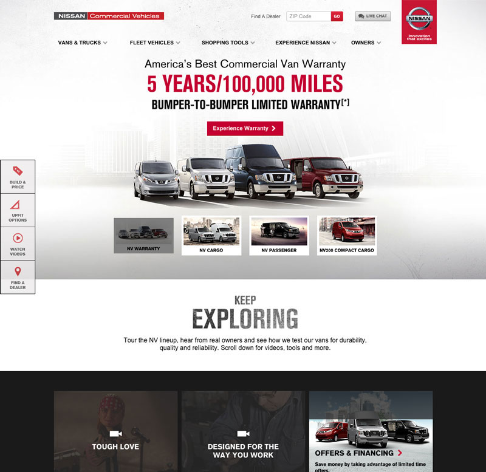

Nissan Commercial Vehicles is, you guessed it, the commercial branch of Nissan. They manufacture a series of fantastic work vehicles that you've undoubtedly seen all over town–as soon as you know what one looks like, you can't stop seeing it. I had the pleasure of working with a small team from Critical Mass to redesign the site and introduce a lot of new campaigns to showcase how Nissan was making an excellent work vehicle.

The site was run on a Grails back-end, and we utilized a number of different technologies on the front-end. There are a few parts of the site that use Backbone to create a more robust web app experience, and the rest of it is just good old GSPs, Javascript and SASS. I came on to the account in 2013 during a period of major transition. One of the original team members built a framework that was running a lot of the front-end logic on the site. While ambitious, his framework definitely left some things to be desired that could be fixed by refactoring a good chunk of the code and utilizing modern tools. In the time that I was there we implemented a stronger SASS organizational structure, dependency management using Require.js, a component structure utilizing Flight.js, the start of a decent Gulp workflow, and the aforementioned Backbone conversion.

We facilitated a pretty major overhaul of the look and feel of the site in the few years that I was on the account. The brand still retained the grittiness that's expected of most commercially-oriented sites, but it definitely refined itself over time.

For instance, during the homepage redesign we took the homepage from this:

  

    
    <a class="image-caption">Old NCV Homepage</a>
  

  

    
    <a class="image-caption">New NCV Homepage</a>
  

Screenshots can only do so much–to fully experience the site, you should definitely go and check it out at <a href="http://nissancommercialvehicles.com" target="_new">nissancommericalvehicles.com</a>. Some of the pages that I had the most involvement with are the <a href="http://nissancommercialvehicles.com" target="_new">home page</a>, the vehicle landing pages for the <a href="http://www.nissancommercialvehicles.com/nv-cargo" target="_new">NV Cargo</a>, the <a href="http://www.nissancommercialvehicles.com/nv-passenger" target="_new">NV Passenger</a>, and the <a href="http://www.nissancommercialvehicles.com/nv200-compact-cargo" target="_new">NV200 Compact Cargo</a>, and the launch of the <a href="http://www.nissancommercialvehicles.com/nv200-taxi" target="_new">NV200 Taxi</a> for its maiden voyage in NYC.
