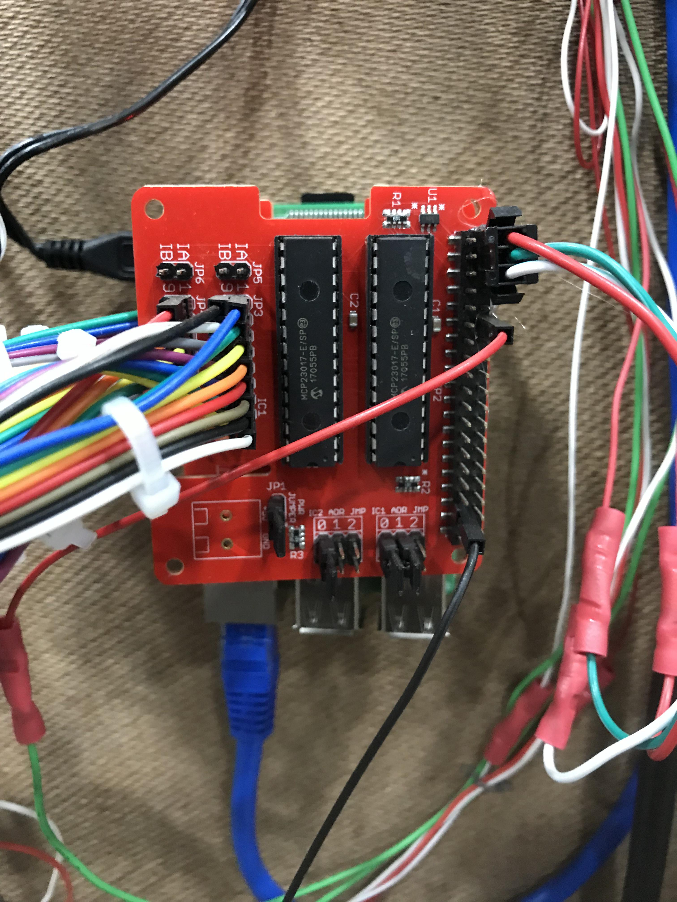

Retailers have their work cut out for them if they’re going to keep up with Amazon. The scale and speed at which they operate has completely transformed consumer expectations–two-day shipping has become the de facto standard for delivered goods. A.C. Moore, a major arts and crafts retailer for the eastern part of the United States, realized that they would have a major problem on their hands if they didn’t adapt to meet that shipping speed. There’s only so much control that they have over an order when it leaves their warehouse, but they can control how quickly they process orders inside their operation.

One of the pieces of their order fulfillment puzzle was a strategy called "Put to Light." Whenever an order comes into their warehouse it is split into three major phases–picking, sorting, and packing. During the picking phase, items are retrieved from the warehouse floor and sent along conveyors in a series of "pick waves." When a pick wave is ready to be sorted, it gets diverted to a put wall. That’s where I come in! A.C. Moore knew that they wanted put walls, but they weren’t happy with the existing options, and they wanted one that would integrate perfectly with their custom-built warehouse management system. They asked if I could build them nine custom put walls, and before I knew it, I was knee deep in warehouse logistics!

  
  <a class="image-caption">The completed put walls</a>

At its core a put wall is a fairly simple technology. We needed to be able to light up a specific location under a bin on a shelf where an item would be placed, and then listen for a button click to confirm that the picker put the item in the bin. While simple from a hardware perspective, there is a lot that needs to happen on the software side of things, and it gets increasingly complex as you try to scale it. Whatever solution I came up with needed to be able to communicate to the endpoints of their warehouse management system (WMS). It also needed to be able to do it for roughly 500 bins at a time, with absolutely no errors, as fast as it possibly could.

  
I decided to use a Raspberry Pi for the brain of each put wall. We needed to be able to perform some pretty complex handshakes with the WMS that would have been an absolute nightmare to attempt on an Arduino. While the Pi was better-suited for the networking side, it does not ship with the kind of inputs and outputs that we needed. Each put wall needed to listen to 52 buttons and run approximately six thousand WS2812B LEDs.  The first thing to account for were the buttons. We needed twice as many inputs as were available on the Pi, which meant that I’d have to find an external way to expand the I/O capabilities. I sourced an excellent stackable HAT from ModMyPi that gave us access to two MCP23017 port expander chips. By stacking two of these HATs on the Pi we could move all of the inputs from the buttons off of the main GPIO pins. That left enough room for us to drive the extremely long LED strips and account for all the buttons.

  

    
    <a class="image-caption">The MCP23017 HAT with everything plugged in</a>
  

The LEDs were split into two long zig-zag strips–one for the putting side on the front, and one for the packing side on the back. The general idea is that when an item is scanned, the bin that it goes in will light up blue on the front of the wall. When a picker places the item in that bin, they hit the button, and then the system checks if anything else needs to go into the bin to complete the order. If the order is ready to ship, then the LEDs on the other side of the wall light up green to let the shipping department know that the bin is ready to be pulled from the wall and packed for shipping. At 3,000 pixels long we were definitely stretching the boundaries of what our Neopixels were capable of. We were, however, able to get great performance out of them thanks to a beefy power supply that was introduced at multiple parts of the circuit and no need for animation along the strips. Ultimately each wall would only have 30 or 40 LEDs turned on at a time in most cases, so we were able to run both strips from two pins on the Pi. We wanted to go with a full RGB LED rather than a solid-colored strip in order to communicate different phases of a pick wave. For instance, if a picker realized that something was wrong after they confirmed an item’s placement, they could flag the location for a QA check from the tablet computer attached to the wall. This would then light up the front and back of the location with orange lights to let both sides know not to proceed with that bin.

After I squared away the physical production side of mounting all the buttons and running all the LEDs, we needed to determine the most efficient way for the Pi to communicate with the WMS. I decided to build a custom API that communicated with the WMS via a MQTT server. MQTT has been around since 1999, but has become increasingly popular because of its usefulness in IoT projects. As its core, MQTT is a super lightweight pub/sub communicator that lets you rapidly send or receive small bits of information. This was perfect for our use case–the wall would subscribe to lighting messages coming from the WMS, and then publish button presses back to the WMS. In addition to the speed of MQTT, you can also set a quality of service. This means that you can say if you want a message to continue trying to send until it receives a confirmation that the message was received. Having the system be able to confirm a message like that was a huge help in making sure that there were zero errors during processing.

We had the luxury of setting up a brand new warehouse for A.C. Moore in Chicago at the start of this project, so we began by only running three of the nine put walls on the new system to make sure that everything worked. There was a fair amount of wear and tear on the shelves since everyone is the warehouse is moving so quickly, but I designed the system to be as modular as possible and to be simple enough for any of the warehouse managers to repair. After a few tweaks to the physical design of the system, we rolled out the other six walls right before Black Friday, where they ran for almost two days solid. Since then A.C. Moore has also installed five of the walls in their main warehouses in Berlin, New Jersey.

The whole process can be a lot to wrap your head around if you aren’t familiar with warehouse logistics. Check out the video below to see what a full pick wave looked like when I was testing it with an A.C. Moore employee.

<video src="./blitsy-pick-wave.mp4" controls muted autoplay loop></video>

  
