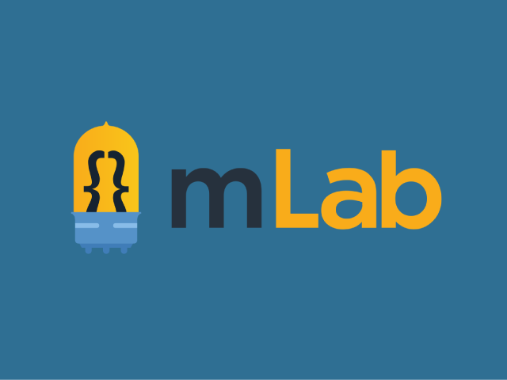
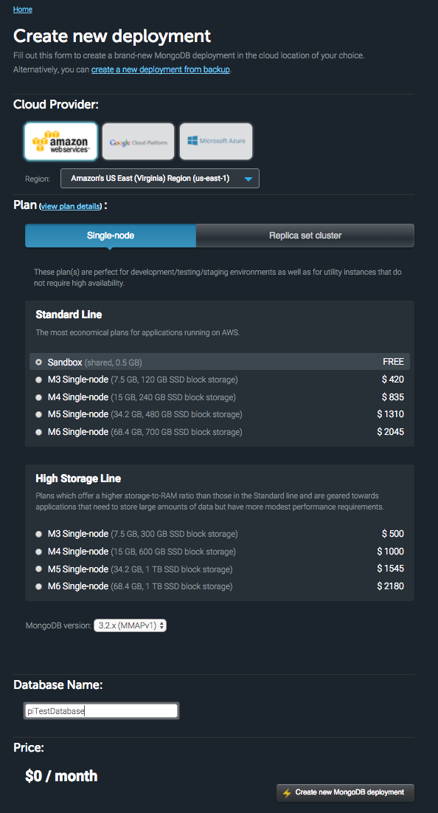

The Raspberry Pi tends to end up in a lot of projects that benefit from collecting, storing, and analyzing data - when you have a full computer that costs 35 bucks, it makes sense to attach to everything that you want to learn from! There are plenty of options on what to do with the data you collect, but my absolute favorite so far has been working with MongoDB through mLab. This post will walk you through setting up a basic server in Node that will let you push data from you Pi up to mLab's cloud-hosted MongoDB instances.

<div class="image-container large-image">
  
  <a class="image-caption">mLab Logo</a>
</div>

### Creating a mLab Account

<div class="paragraph-with-picture">
  <p>mLab has enterprise options for larger companies that use their service, but they also have a 0.5 GB free tier that's great for smaller projects like this. Go ahead and sign up for an account - once you're logged in, we can get you started on what kind of deployment you'll need. We'll be using a sandbox environment. To create a new sandbox, click the "create new" button - this will take you to the configuration screen.
  <br/><br/>I prefer to run my instances on AWS, but you can also run on Google Cloud or Microsoft Azure. For this tutorial, let's select AWS. You can pick what region you'd like to run your AWS instance from, but for general-purpose applications, the default of US-East-1 is pretty solid. Click "single node" to reveal the smaller options, and then click "sandbox" to choose our deployment type. There's only one version of MongoDB available for sandbox accounts, so you can just let the version stay as-is. The last thing we need to do is come up with a name for our database - let's call ours "pi_test_databse".</p>

  <div class="image-container small-image">
    
    <a class="image-caption">Configuration for a Sandbox Deployment</a>
  </div>

</div>

### Added a user to our database
Once your mLab deployment is created, go ahead and click into it, then click the "users" tab. We'll need to add an admin user to interact with our database. Create a user called "admin" with a strong password, and leave the "read-only" box un-checked.

### Setting up Node on a Pi with NVM
If you're running the latest instance of Raspbian Jessie, the Pi should already have Node installed. If you need help getting your Pi set up with Raspbian, <a href="/ansible-pi" target="_new">check out my other blog post about standing up a headless Pi with Ansible</a>. We could certainly run with this pre-installed version of Node, but it's a very old version, and we want the new shiny stuff. In addition to that, we want to be able to switch between versions for different projects. To handle this switching, we're going to install something called <a href="https://github.com/creationix/nvm" target="_new">Node Version Manager</a>, or NVM for short. <a href="https://github.com/blobsmith/raspberryTestNode/wiki/Node.js-installation-with-nvm-on-Raspberry-pi" target="_new">Here's the set of instructions that I've followed to accomplish this.</a> Feel free to hop over to Blobsmith's GitHub and follow his guide, or you can just keep reading here to get the gist of it.

First off, we need to download NVM. Do this by running "`git clone https://github.com/creationix/nvm.git ~/.nvm && cd ~/.nvm && git checkout v0.33.1`" on your Pi. This clones the repo to a ".nvm" folder inside our home folder, then checks out the latest code. At the time of this post, the latest is version 0.33.1, but you should change that to the latest stable version when you're doing this on your own. Next, we need to add the command to source NVM to our .bashrc and .profile files. Do this by executing the following commands on your Pi:
- "`sudo nano ~/.bashrc`" - add "`source ~/.nvm/nvm.sh`" to the end of the file
- "`sudo nano ~/.profile`" - add "`source ~/.nvm/nvm.sh`" to the end of the file

It's a good idea to leave a comment for yourself so you know why that extra line is there. You can do that by starting a new line with the "#" sign. After you've saved those files, reboot your Pi and SSH in again.

When you're back in, type "`nvm`" to see if the install worked. You should get the manual page for NVM. We're going to start by installing the latest stable version of Node - do this by running "`nvm install stable`". Once that's done, if you type "`nvm ls`", you should see two versions of Node installed - one for the stable version we just added (v7.7.3 in this case), and one for the system version. Congrats, you're now able to install multiple versions of Node on your Pi!

### Creating our project
In your home directory, make a new directory called "pimlabtest" and cd into it by running "`mkdir pimlabtest && cd pimlabtest`". We'll start by telling this directory to use the version of Node that we just installed. Run "`nvm use stable`" to accomplish this. Next, we'll run "`npm init`" to get us set up to pull packages from Node Package Manager. Feel free to enter the fields that it asks you for if you'd like, or you can just hit enter a few times to accept the defaults. If we `ls` in that directory, you should see that NPM added a package.json for us to keep track of all of our modules. We're going to start by installing a few packages - run "`npm install --save express mongoose body-parser ip request node-cron`". This will get us set up to start scaffolding our project. It's worth noting that this will only install these packages in this specific node_modules directory for this specific version of Node that we set with NVM.

Next, create a file called `server.js` by typing "`nano server.js`". This will bring you into the nano editor where we can start writing our code. Let's start with our basic module declaration and server setup. Enter the following code:

```js
var express = require('express'),
    mongoose = require('mongoose'),
    bodyParser = require('body-parser'),
    ip = require('ip'),
    request = require('request'),
    cron = require('node-cron'),
    app = express(),
    port = 8000;

app.listen(port);
console.log('server listening on port',port);
```

Now that we have that file created and our packages installed, you should be able to run "`node server.js`" and get a message back that the server is listening on port 8000.

### Setting up basic routes
We'll continue building our database interactions out by scaffolding our basic CRUD operations (create, read, update, delete). If you've got all of those bases covered, there isn't much that you can't do with this database. Let's start by creating a few directories to organize our project. Create an app directory, and then inside that create a routes directory. After you've created those two folders ("`mkdir app && mdkir app/routes`"), create an index.js file in your routes directory by typing "`nano app/routes/index.js`". We need to tell Express to route our index route through something called "middleware". Middleware exists to help us work with the data between Node and database - the most important this we'll be using it for is to grab the request and response objects. Enter the following code in this file:

```js
var express = require('express'),
    router = express.Router(),
    bodyparser = require('body-parser');

// router middleware
router.use(function(req, res, next){
  next();
});

router.route('/')
  .post(function(req, res){
    console.log('Index route is good!');
  });

module.exports = router;
```

Once that file is good, we need to go back over to server.js and tell it about the work that we just did. It's a good time to mention that you can certainly test this application through something like <a href="https://www.getpostman.com/" target="_new">Postman</a>, but we're going to be doing the same thing in our server code by using the Request and IP packages.

To start, let's tell our server code about our IP address. We'll use this to route our requests to the Pi's IP. Add the following code to your server.js file right under our other variable declarations:

```js
var myIp = 'http://' + ip.address() + ':' + port;
```

While you're at it, you can also replace our console.log statement in server to log the full IP and port. Change "`console.log('server listening on port',port);`" to "`console.log('server listening on',myIp);`". Run "`node server.js`" again and you should get your IP listed out.

Now we need to tell server.js about our index route. Since we exported the module as router at the bottom of the "app/routes/index.js" file, we can reference that router in other files now. Include the following code in server.js to do so:

```js
// Include routes
var indexRoute = require('./app/routes/index.js');

// Register routes
app.use('/', indexRoute);
```

So we've told our server.js about the route, but it still isn't doing anything. This code won't actually produce a result until we make a request to ask it to do so - this is where our IP declaration and the request package come in. We're going to enter the following code in server.js right under our console.log statement to handle that action:

```js
// request the index route
request.post(myIp + '/');
```

Now when you restart your server ("`node server.js`"), you should see the original console.log, along with another that says, "Index route is good!" This means that our routing is hooked up and ready to go!

### Telling our app about the database
We've got our main route covered, now we need to tell the app about the database that we'll be working with. We'll start by making another directory inside "app" called "models". Inside that models directory, we'll create a file called "piMlabTestDatabase.js". In this new file, we'll use Mongoose, an object modeling package that makes working with MongoDB a lot easier. We'll need the database URL to get started here - go back over to mLab in your browser, click into your database, and look for a message at the top of the page that says "To connect using a driver via the standard MongoDB URI". We need to copy that full URL underneath that line. Now let's go back over and edit our piMlabTestDatabase.js file that we created on our Pi. Enter the following code - make sure to replace the credentials sections (dbUser, dbPassword, yourDBUrl, yourDBName) with the URL that you just grabbed:

```js
var mongoose = require('mongoose');
var mongoAddress = 'mongodb://<dbUser>:<dbPassword>@<yourDBUrl>/<yourDBName>';

var options = {
  server:{
    socketOptions:{
      keepAlive: 300000, connectTimeoutMS: 30000
    }
  },
  replset:{
    socketOptions:{
      keepAlive: 300000, connectTimeoutMS : 30000
    }
  }
};

mongoose.connect(mongoAddress, options);

```

Once we have that file saved, we can go back to server.js and tell the server about our mLab connection. Add the following line to server.js above where you declared your route.

```js
// Include models
var db = require('./app/models/piMlabTestDatabase');
```

Restart your app to make sure everything works - we should still only be getting the two console.log statements.

### Defining a model
Now that we have our database hooked up, we need to tell it what kind of data we actually want to upload. Let's start by determining what data we want to store - say that you have a Pi that you're using as an awesome media player, and it sits on a sunny ledge in your living room. We want to track the temperature of our Pi to make sure that it isn't getting too hot in the sun, so we'll create a model to log that temperature. Start by creating another file in your models directory called "piTempModel.js", then enter the following code in it:

```js
var mongoose = require('mongoose');

var PiTempSchema = mongoose.Schema({
    timestamp: Date,
    temp: Number
});

module.exports = mongoose.model('PiTemp', PiTempSchema);
```

All we're doing here is telling our MongoDB the name and what kind of data we'll be storing. We'll create a timestamp to help us analyze our data, and then ask the system what the current temperature is and return it as a number. Once again, we'll need to go back to server.js and tell it about this new model file. Enter the following code under the line where you included your database:

```js
var piTempModel = require('./app/models/piTempModel');
```

### Creating a model
We've got our model set up, so now we need to actually create the model. We'll do this in our index route file. First we need to install another NPM package to be able to read the system temp. Run "`npm install --save child_process`" from the root of your project to install the new package, then navigate back to editing your routes/index.js file. That child_process package will only be used for this index route right now, so we can include that in the variable declarations at the top of the file.

```js
var exec = require('child_process').exec;
```

We also need to tell this routes file about the model file we just created. Add the following line in your variable declaractions section of the /routes/index.js file to do that:

```js
var PiTemp = require('../models/piTempModel');
```

Now we can get on to actually handling the action and creating a record in the database! We'll include the code to get the current temperature and send it to the db inside your ".post" function in /routes/index.js. Here's a quick rundown of how we'll get the temperature:

```js
router.route('/')
  .post(function(req, res){
    console.log('Index route is good!');

    getCurrentTemperature = (function(){
      var child = exec('cat /sys/class/thermal/thermal_zone0/temp', function(err, stdout, stderr){
        if(err){
          console.log('There was an error getting the current temp:',error);
        } else {
          var currentTemperature = parseInt(stdout)/1000;
          console.log('Current temp is:',currentTemperature,'ºC');
        }
      });
    }());
  });
```

If you restart your server, you should see the two original console.log statements, plus a new one that's telling you the current temperature of your Pi in celsius. You'll notice that we wrapped the getCurrentTemperature in an <a href="https://developer.mozilla.org/en-US/docs/Glossary/IIFE" target="_new">IIFE</a>, which means that the function will run as soon as it gets defined. Now we can move on to actually saving that to the database.

We'll need to add a timestamp to satisfy our model's requirements, then all we need to do is actually send it. You can find how to do that in the following code:

```js
router.route('/')
  .post(function(req, res){
    console.log('Index route is good!');

    getCurrentTemperature = (function(){
      var child = exec('cat /sys/class/thermal/thermal_zone0/temp', function(err, stdout, stderr){
        if(err){
          console.log('There was an error getting the current temp:',error);
        } else {
          // add the date
          var thisDate = new Date();

          // add a new instance of our model
          var thisTemperature = new PiTemp();

          var currentTemperature = parseInt(stdout)/1000;

          // tell the model what data we want it to use
          thisTemperature.timestamp = thisDate.toISOString();
          thisTemperature.temp = currentTemperature;

          // save the record to the db
          thisTemperature.save(function(err){
            if(err){
              res.send(err);
            } else {
              console.log('New temp recorded in the database as:',currentTemperature,'ºC');
              res.send('new temperature recorded to the db');
            }
          });
        }
      });
    }());
  });
```

Go ahead and restart your server. If everything is working correctly, you should see the console.log output that it saved the DB. Just to make sure, let's hop back over to our mLab page in the browser. Refresh the page, and you should see that a new collection called "pitemps" was created, and it now has one document in it. Congratulations, you just coded the first step to creating an API for your Pi! Click into the pitemps collection, and you should see a JSON output of the document with your current temperature reading and timestamp.

### Setting up a cron job to read the temperature
We've got one reading, but what we really want is to have our Pi report the reading every 20 minutes. We'll use node-cron to do this back over in our server.js file. At the very end of your server file, we'll add a cron job to use the request model to hit the main index route.

```js
cron.schedule('*/20 * * * *', function(){
  request.post(myIp + '/');
});
```

Now you should get an initial reading when you first start your server, and then an additional reading every twenty minutes as long as the Pi is running your server code.

### Next steps: the RUD part of CRUD
In the next tutorial, I'll go over how to adapt this code to cover the rest of our CRUD operations. With the additional actions, you'll be able to read all the documents in your database, read a specific document, update a specific document, and delete a specific document. Part two of this series is coming soon.
