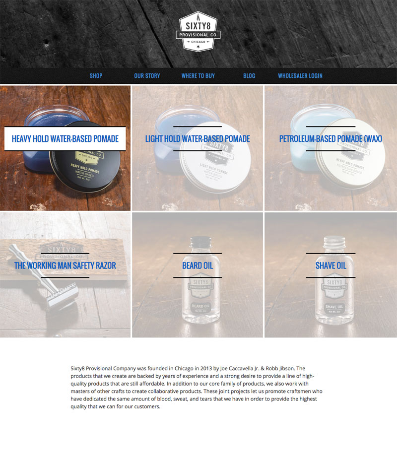
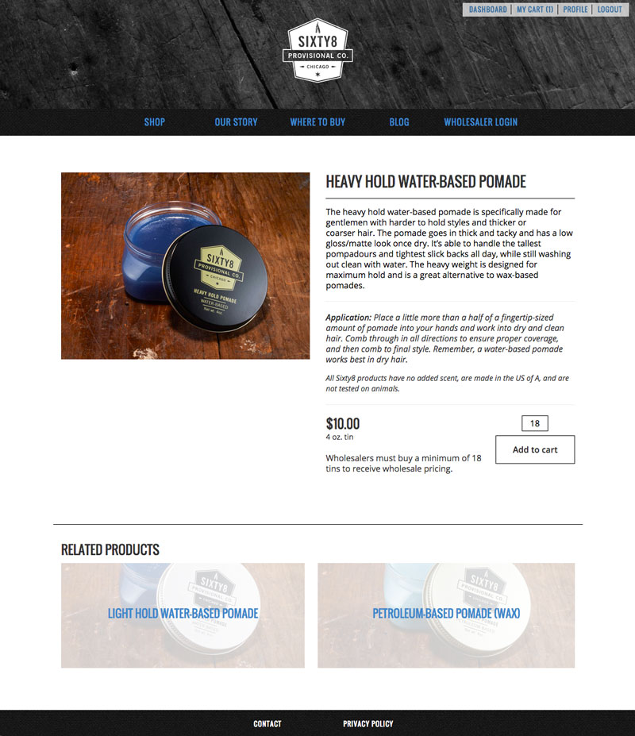

A clean website built for an even cleaner grooming product. Sixty8 Chicago makes pomades and other barber-related items for the discerning gentleman, and I was lucky enough to build the website for their product launch.

Joe Caccavella, Jr helps run Joe's Barbershop Chicago with his father, Joe Caccavella, Sr. The shop opened in Logan Square in 1968, and has been turning out quality barbering ever since. For those familiar with Logan Square, the fact that anything has been around that long and withstood the changes to the neighborhood is a testament to the quality that the shop provides.

I actually used to live behind the barbershop before it expanded. If you visit, there's a pretty good chance that you'll be getting a haircut where I used to sleep or work. All this goes to say that Joe and I go back and few years, and we've had a great business partnership ever since we met each other. Another one of Joe's longtime customers, Robb Jibson, is the other half of Sixty8 Provisional Co. The two set out to make a line of pomades that could keep up with the standard that the shop holds themselves to, and they've since expanded to include a bevy of other high quality grooming items.

The site runs on a built-from-scratch fully-responsive Wordpress theme in order to make it easy for the guys to update it and keep it running. This was the first venture into e-commerce for Joe, who is in charge of keeping the wheels turning on the orders front. I was able to build a full solution for them using WooCommerce that lets Joe get in and out as quick as possible so he can spend more time barbering and less time futzing with inventory and wholesale user management.

In addition to the standard e-commerce needs, the site includes a series of utilities to facilitate wholesale purchasing. Sixty8 needs to vet their wholesalers in order to maintain the reputation of the product, so I built them a system where folks could apply for wholesale priveleges. Once the application is submitted, Joe is able to vet the applicant and see if they cut the mustard. If they're approved, wholesalers have the option to makes bulk purchases that aren't available to regular users.

  

    
    <a class="image-caption">Sixty8 Home Page</a>
  

  

    
    <a class="image-caption">Sixty8 Product Page</a>
  

