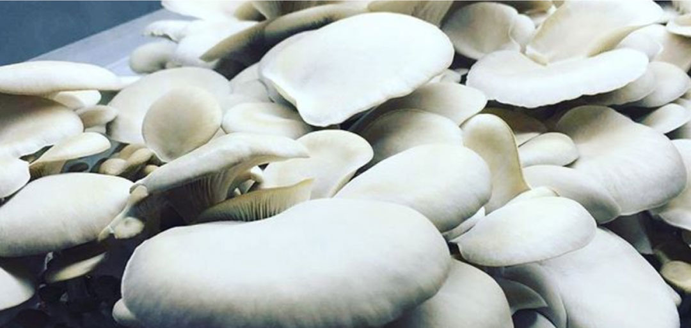
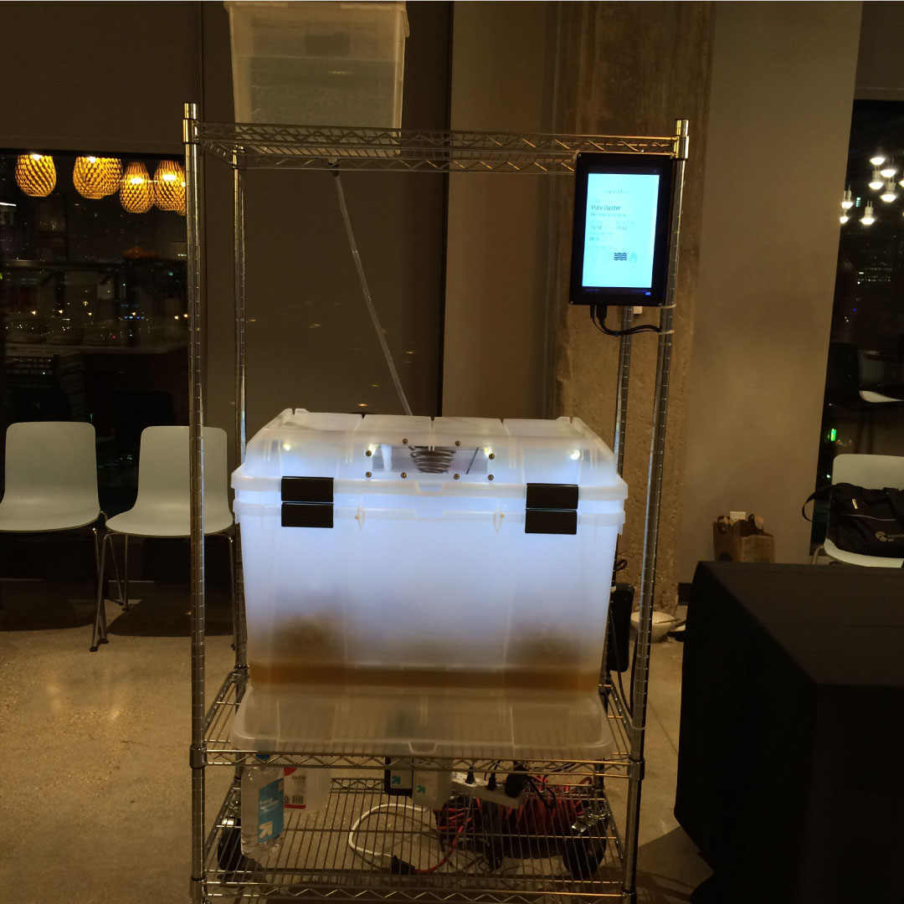
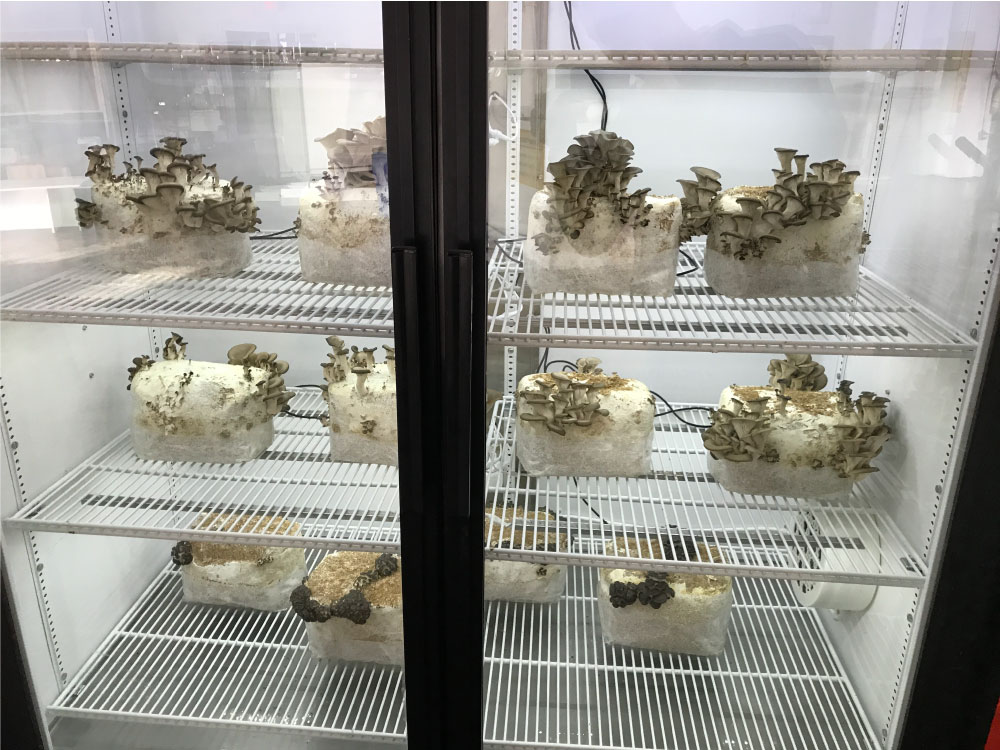
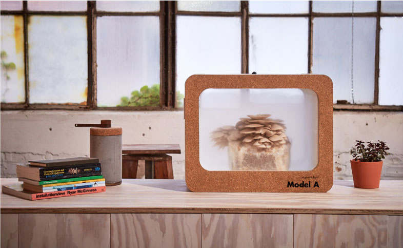

Sojourn Fare creates environmental control units that help people grow mushrooms, cure meat, make cheese, and a whole host of other applications. Back in the fall of 2016, Roman Titus reached out to see if I could help him with a small Arduino project. Now that we're two years into the project, it's grown to be so much more.

  
  <a class="image-caption">Pleurotus ostreatus growing in one of the first prototype units</a>

The original prototype started with Roman searching for a solution to make growing mushrooms a whole lot easier. He was running a small grow of Pleurotus ostreatus, more commonly known as oyster mushrooms, in his apartment when he had to leave for a week. When he came back, the crop had dried out and died. He was correct in assuming that technology could help him find a solution for that problem. His original rig consisted of some basic monitoring and modifying via an Arduino, but he had much bigger ideas for the unit.

We started working together on a prototype for a unit that could be remotely monitored and controlled. The growing chamber needed to be able to control, at a bare minimum, humidity, carbon dioxide, temperature, and fresh air circulation in the chamber. In addition to this, we wanted to make the unit smart enough to control these parameters on its own. The initial prototype ran on a series of timers set via an Arduino, but we knew that we could make it better.

	
Roman and I worked to refine the unit over the next few months, and eventually ended up with a grow chamber that was steady enough to get placed in the cafeteria at the Google Chicago campus. This unit had a lot of the components that would evolve into our next unit, but it still had room for improvement.

  

    
    <a class="image-caption">The original Sojourn unit at Google</a>
  

The lessons we learned from this unit lead to the redesign of the temperature control, as well as an upgrade the the carbon dioxide sensor that we were using. The biggest challenge that we faced at this time was the fact that most CO2 sensors weren't designed to work in high-humidity environments. I worked with Roman to source and test a series of CO2 sensors until we were able to find one that worked for high humidity – the only downside was that it was significantly more expensive than the readily available sensors that we were using before. On the upside, we were now able to wrap a few of our measurements into one sensor.

The unit over at Google was a ton of fun to work on, and it proved out the fact that people were hungry for this kind of grow-it-yourself unit. That success felt good, but we knew that the unit wasn't fully actualized in that iteration. The next goal was to take the growth operations to a larger scale. We knew that the storage bin that we used for the first unit wasn't great at regulating temperature, so we decided to retrofit a large commercial refrigerator for the next version.

  
  <a class="image-caption">The retrofitted fridge unit</a>

The new unit, dubbed the Momo, was able to produce around 200 pounds of mushrooms a week when fully loaded. Scaling up to that size taught us a lot about the limits of the sensors that we were using - after a few more tweaks, we were confident that we could scale this up to farm-sized operations. The codebase also underwent a decent refactoring at this stage. The previous setup involved setting high and low points for all of our environmental factors, but we knew that the Momo could be smarter. We set up data visualization tools to help us understand exactly what was going on in the unit, and ultimately ended up writing code that let the box adjust its own settings within a range. This code to help the box learn how to better operate let us stabilize the environment even more.

The Momo taught us a lot about scaling operations, but we still had other ideas to prototype. All of that research led us to create the Sojourn Model A. We realized that the brains of our units could scale to multiple sizes, but for the time being, we wanted to explore how a tabletop-sized unit would work. The next iteration of our unit was named the Sojourn Model A.

  
  <a class="image-caption">Sojourn Model A</a>

We're currently experimenting with the Model A to see how we can improve our operations. This was the first unit that we were able to build from scratch, which opened up all sorts of new possibilities in regards to design and materials. Over the coming months, we'll be continuing our iterations and explorations over at mHub - make sure to check out the full Sojourn Fare website to keep up with our process.
