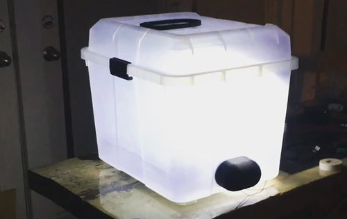

Sojourn Fare was an ag tech startup that I co-founded in 2016. The company produced IoT environmental control units that helped make mushroom cultivation approachable and reliable. While growing most mushrooms isn’t very hard on its own, there are lots of things that can go wrong during the growth cycle that will completely ruin a crop. Those bumps in the road are why Roman Titus, my co-founder, came to seek out my help. Roman had a batch of Pleurotus ostreatus, more commonly known as oyster mushrooms, growing in his apartment. He lost an entire container of oysters to trichoderma mold after leaving on some last-minute travel for a few days, and had a hunch that technology may be able to help prevent that from happening again. We set out to create a more user-friendly system that did a lot of the hard work of mushroom cultivation for you.

  
  <a class="image-caption">Pleurotus ostreatus growing in one of the first prototype units</a>

Our initial prototypes consisted of an Arduino-controlled timing system that ran a roughly scheduled series of environmental modifiers to maintain the right conditions for mushroom growth. This was a good start, and it did meet the requirements of keeping the crop alive without having someone tending to it every day, but there was a lot of room for improvement. Roman had a lot of ideas about the physical design of the unit, and I had a lot that I wanted to do with the software and hardware side, so we both set off to make a more complete prototype.

  
We had been relying on an Arduino Mega to run the environmental modifiers, which included heaters, fans, lights, and humidifiers. That would have been fine If we wanted to keep running everything on a basic schedule, but I knew that we could incorporate sensors into the mix to have more relevant data to work with. Keeping things on a schedule was just replicating the traditional methods of mushroom farming–we could make it better! Another big blind spot was being able to see what the unit was actually doing. We had a lot of data being printed out via the serial port on the Arduino telling us what was on or off, but there wasn’t a good way to see the readings, and we definitely weren’t storing the data for long-term analytics. I decided to scrap the old code and move everything over to a Raspberry Pi, which had been around for four years at that point, but was really starting to pick up steam in 2016.

  

    
    <a class="image-caption">One of the first iterations of the grow chamber</a>
  

The use of the Pi opened up a lot of doors for us. Now we didn’t just have something that could turn the modifiers on or off–we had a whole server that we could run on the unit. After replicating the basic functionality of the timers that we had running with the Arduino, I moved on to integrating sensors into the system. I built an application that ran on Node, Express, and Mongo, and was able to respond in real-time to sensors that measured the carbon dioxide, relative humidity, and temperature inside the unit. I had also been hearing a lot of people praise a new JavaScript framework called React over the previous months–I had done a little work with Angular before the notorious 2.0 split, so I wanted to try out React while everything settled down in the Angular community. I decided to use that to build a super simple front-end that would show the current readings for the unit, and we never turned back from using React. It gave us the same flexibility in componentization that we had on the physical side of the unit, and ended up being perfect for us.

  
That initial unit worked well enough for us to regularly produce decent yields of oyster mushrooms with very few issues. We were harvesting a little under a pound a week per substrate block, which was acceptable. At this point we were targeting two main groups–restaurants interested in hyperlocal produce, and mushroom enthusiasts looking to grow their own at home. We started building this unit at a local makerspace, and were connected to Google Chicago’s head chef through a mutual friend. They loved the idea of growing food on-site, and encouraged us to build a unit for their cafeteria. Roman facilitated the grow, and we ended up being able to deliver a few pounds of fresh mushrooms to the Google chefs every week.

  

    
    <a class="image-caption">The prototype unit at Google</a>
  

We had a little bit of momentum from the Google project, and we had a lot of chefs and restaurants saying that they were interested in the product. One of our contacts at Google mentioned that they had a large refrigerator that they would be willing to donate to us, which we happily took. The size constraints of the first unit limited us to two substrate blocks per growth cycle, which was not enough to justify purchasing the unit for most restaurants. We retrofitted the refrigerator to be able to maintain the environment just like the smaller units, but now we had the potential to produce almost 200 pounds of mushrooms per week. This got us excited about the potential for other businesses like farms to be able to add mushroom production to the services and goods that they offered.

While working with Google was a great clout builder and an extremely fun experience, we quickly realized that the restaurant-focused mushroom business wasn’t going to do us any favors. Smallhold, our major competitor, was already doing an excellent job producing bespoke mushroom-growing chambers for small restaurants in Brooklyn. It was incredibly fun to work on those one-off projects, but they weren’t paying the bills, and Roman and I were still trying to bootstrap the startup. At this point, Roman and I decided to split our focus on what we thought would be the most likely to have some success–he focused on making a consumer version of the kit that could fit on a kitchen counter, and I focused on building something that could be used in classrooms.

Roman’s consumer-focused venture had a decent strategy that seemed worth pursuing. Consumer’s attitudes around mushrooms were evolving. There was a massive opportunity in the medicinal market for mushrooms like reishis or lion’s manes, and foodies were quickly realizing that there were other kinds of mushrooms besides the white button style that were ubiquitously available. He took the same technology setup that I used for the rest of the products and built a beautiful iteration called the Model A.

  
  <a class="image-caption">Sojourn Model A</a>

While Roman was shopping the consumer level product around, I took on the responsibility of developing something that we could use to work with educators. We had a lot of organic interest from teachers, but we knew that the high price point of individual units wouldn’t be viable for most schools. I worked with a series of schools that already had an agricultural component to them in order to figure out what an educational product would look like. After a lot of market research and convincing, we ended up getting connected to ComEd, the power company for Illinois. ComEd was hosting an event called the Solar Spotlight, and this year they wanted a food-focused product that the students could build. The gist of the event was that ComEd would invite students from underprivileged parts of Chicago to come work with them over two weekends to learn about STEM and solar power. They loved our idea, and were incredibly interested in getting students excited about growing their own food. They asked us if we could make a kit version that high schoolers could assemble, and if we could integrate solar power into the unit.

  
I set out to determine what aspects of the unit we could actually power via solar, and Roman took to redesigning the unit with a focus on bringing down the cost and making it accessible to high school students. We ended up modifying a small storage bin to serve as the main compartment for the unit. All of the modifiers, sensors, and other components were consolidated to one central 3D-printed mount that lived on the back of the enclosure. The amount of solar power that we could generate with the nine watt, six volt panel that we sourced wasn’t enough to run everything, but it was enough to power the Raspberry Pi that controlled all of the moving parts.

  

    
    <a class="image-caption">The Builder's Kit</a>
  

We hosted two events with ComEd–one for Black History Month, and one for the National Hispanic Heritage Month. Each event consisted of groups between sixty and seventy students assembling and testing their mushroom growing unit in small groups over the span of four hours. The work was challenging, but ComEd provided employee mentors to sit with each group to make sure that they could successfully complete their kit. Students were informed at the end of the day that the units they built would be delivered back to the schools for use in their science classes over the next semester. Roman and I had been working on sample curriculum to teach experimental design using the kits–we wanted to make sure that the educators who would be receiving these kits had a clear path forward on how to integrate them into their lesson plans without a ton of extra work.

  <iframe width="476" height="267" src="https://abc7chicago.com/video/embed/?pid=5143962" frameborder="0" allowfullscreen></iframe>

 

The Solar Spotlight events were extremely successful, but unfortunately financial circumstances led to us having to shutter the company in the spring of 2019. Roman had always been paying the bills with a mix of freelance and working on the startup, and I had been doing the same after I left my full-time role at Fjord in the summer of 2018. Roman made the tough decision to move back to Ohio, and I decided that I would try to tackle our final Solar Spotlight event the following September on my own. That outcome is obviously not what either of us wanted, but I wouldn’t trade the experience for anything. While Sojourn wasn’t the first startup that I worked on, it was the one that got me hooked. The things that I learned and ideas that I explored there drastically changed my practice as a developer, and I would not be writing the same kind of code or approaching problems in the same way without having worked on those products.  
