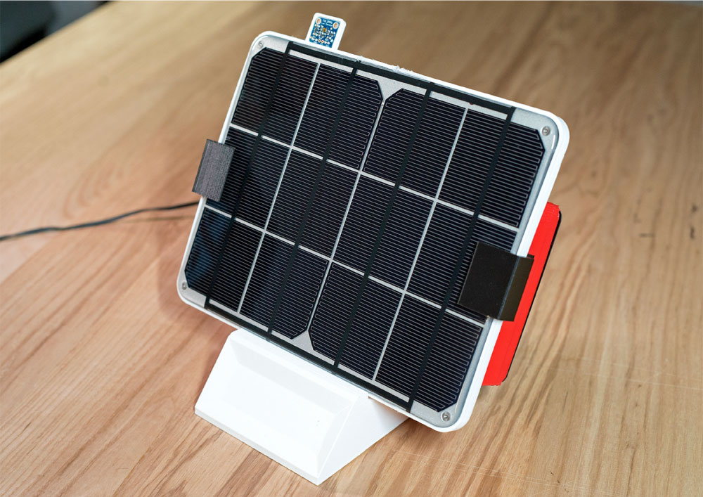

The first thing we did when I was hired to start the creative technology practice at Fjord Chicago was sit down and establish a few goals. The foremost goal of the entire practice was to get ideas off of a screen and into the real world. When we got a request to revamp the solar installation experience for a major energy provider, we knew that it would be a great opportunity to blend physical and digital experiences to wow their customers.

Our client was located in a state that people thought couldn’t generate enough solar power for it to be worth the effort, but the area actually had a lot of potential for photovoltaic generation. The bulk of the project involved mapping out the entire solar interconnect process and making recommendations about where they could improve their services to be more human-centered, but we also had the opportunity to do extensive research on how their current customers were thinking about solar. We found that customers were often using complicated solar calculators as their first touchpoint in their journey to solar installation, and the current experience left much to be desired.

  
  <a class="image-caption">The finished prototype</a>

If you go to an online solar calculator right now, you’ll be asked for all sorts of information like your current monthly energy usage in kilowatt hours, the pitch of your roof, the average duration of sunlight on your property, and all sorts of other questions that the average consumer won’t readily know. In addition to that, calculations can vary wildly based on who is doing the math. We found that some very popular calculators were overly optimistic, while others tried to push the customer to purchase more equipment than they could actually use. With all of the data that this energy provider had about their customers, we knew that we had a chance to make this process a lot more user-friendly.

We wanted our calculator to be a useful tool for getting accurate information about what a solar installation could do for a residential customer, but we also wanted to use it to get folks excited about the solar potential of their home. We came up with the idea of taking the calculator out of the digital space and into the physical world. What better way to excite people than to actually show them a panel at work?

The prototype needed to be able to collect energy data from an actual panel, then feed that data back into a computer to analyze the data. The first step in that process was to actually get our hands on a few panels and see how they functioned.

	
We decided to go with an iPad-sized six watt panel from Voltaic. The panel was designed for rugged use, and came with a connector that we could easily modify to feed into our prototype. We learned our first lesson by testing how long the panel took to charge the USB battery pack that came with the panel. I was on my bike that day, so I decided to strap the unit to my backpack and see if we could charge the battery at all on my ride home.

  

    
    <a class="image-caption">The Voltaic strapped to my bag</a>
  

  
I got home and saw zero charge. I left the panel out in the backyard for two more hours, but still barely got any charge on the battery. The key lesson there was that solar can be extremely slow. We would need to visualize the data in real-time in order to keep a customer engaged.

  

    
    <a class="image-caption">Testing the panel from Voltaic</a>
  

I decided to use a Raspberry Pi as the brain for the unit due to its size, cost, and availability. The cable that ran from the solar panel was converted to discharge into a voltage sensor, which was then sent to a database on the Pi. That voltage data was great to see coming through, but we were still missing a part of the puzzle–we needed to know what the sun was doing while we were getting those particular voltage readings. To account for that, I added a TSL2591 luminosity sensor to the project. This sensor lets us measure the amount of visible and infrared light, which helps us get a feel for the external conditions that the prototype was being tested in. After a rough assembly of all of these parts, I went out on a nice summer day to field test the components.

  
  <a class="image-caption">Field testing the sensors</a>

The field test went well, and I was able to verify that the voltage being sent to the database was accurate with a multimeter. The next step in our process was to start collecting enough data to explore. I took the prototype home and set it outside for two days to start collecting data. The first day I leaned the panel up against a window on the front of my house, which allowed it to get a good stretch of direct sunlight. When noon hit, I realized that I would need to move the unit to simulate a roof-based panel since the sun was now moving over the house. It wasn’t an ideal testing environment, but I went ahead and moved the panel to the backyard for the afternoon.

  
  <a class="image-caption">Testing the unit on the front of my house</a>

The second day of testing was a little more complicated, but it helped us prove a valuable data point. We had a nice sunny morning that quickly turned into an overcast drizzly day. I was a little bummed as I didn’t think we would get good readings, but the data proved me wrong. It doesn’t matter to the panel if it’s actually clear and sunny outside - it’s looking for infrared light, and there’s still plenty of that on a cloudy day. We were able to show that the panel continued production throughout the rain, which helped us push the point about solar viability in the state that the power company was located in.

  
  <a class="image-caption">Testing the unit in the drizzle</a>

Now that we had data, we could start designing the interface that the customer would use to see their data. We knew that the productized unit wouldn’t ship with a display on it, but I went ahead and added a Raspberry Pi touchscreen for the sake of the demo. This screen needed to show how the panel was performing, what our luminosity readings were, and how all of that stacked up against the customer’s usage data.

	
The first version of the data dashboard was the bare minimum to make sure that we were getting our readings in. None of the data was normalized, the timestamps were still unformatted, and we didn't have usage data yet.

  

    
    <a class="image-caption">The rough draft of the dashboard</a>
  

The full dashboard evolved into something much easier to interact with. The first screen shows the averaged voltage every minute in orange, and the total power generated in red. The second screen shows our luminosity readings from the day–this particular screen is showing the rainy day readings. If you cross reference the luminosity readings with the power readings, you’ll see that our power didn’t dip when we bumped into cloudy conditions.

The last screen shows what happens when we take that generation data and extrapolate it out to a full installation size. I figured out how many of our test panels that we could fit on my roof, then multiplied our power generation numbers to reflect that. In addition to that upsizing, I ran a model that calculated how the performance of the panel would change based on average sunlight duration throughout the rest of the year. That data was then graphed against a real customer’s monthly usage data that we were getting from the power company’s API. The solar prediction is shown in orange, and the monthly usage is shown in red.

Lastly, you’ll notice that we added some explainers on the bottom of the screen to help people contextualize this information. The majority of the calculators we researched spit out info in terms that the average customer wouldn’t be familiar with or care about, so we wanted to make sure to make our information relatable.

  
  <a class="image-caption">Energy generation screen</a>

 

  
  <a class="image-caption">Luminosity measurement screen</a>

 

  
  <a class="image-caption">Usage and solar potential screen</a>

 

The client absolutely loved the finished product, and it’s been one of our most active showcase pieces at the Chicago studio. The upper leadership connected with the product because it was something tangible that they could walk around and show people, and it clearly communicated some key findings from our research. That excitement is what keeps me excited about the work as we continue to see how we can get digital tools off of a screen and into the real world.

  
  <a class="image-caption">The finished prototype</a>

 
